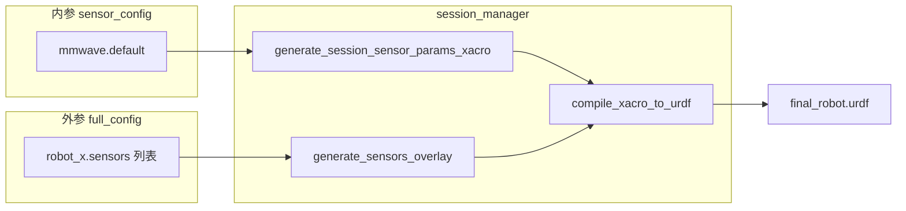

# 毫米波雷达接入整体仿真（配置链路与分阶段启动）

## 1. 当前架构（与海事雷达对照）

| 环节       | 海事雷达 (`maritime_radar`)                                                                                                                                                                                                                     | 毫米波 (`mmwave_radar` / `mmwave`)                                                                                                                           |
| -------- | ------------------------------------------------------------------------------------------------------------------------------------------------------------------------------------------------------------------------------------------- | --------------------------------------------------------------------------------------------------------------------------------------------------------- |
| 内参来源     | `[sensor_config.yaml](src/usv_simulation/usv_sim_full/config/sensor_config.yaml)` `radar.maritime` → `[sensor_params.xacro](src/usv_simulation/usv_sim_full/description/urdf/sensor_params.xacro)`                                          | 同文件 `mmwave.default` → 同名 `sensor_params.xacro`                                                                                                           |
| 外参与挂载    | `[full_config.yaml](src/usv_simulation/usv_sim_full/config/full_config.yaml)` 中 `sensors[].name/parent_link/xyz/rpy` → `[sensor_macros.xacro](src/usv_simulation/usv_sim_full/description/urdf/sensor_macros.xacro)` `maritime_radar_macro` | 同逻辑 → `mmwave_radar_macro`（插件挂在**无 reference** 的 `<gazebo>` 上，避免 lumping / SDF 警告，注释已写在宏内）                                                                |
| ROS 数据出口 | Gazebo 内插件 → 通常再经 `radar_gz_bridge` 等到 `override_topic`                                                                                                                                                                                     | **插件内直接发布** `sensor_msgs/PointCloud2`，`[session_manager.py](src/usv_simulation/usv_sim_full/usv_sim_full/scripts/session_manager.py)` 明确跳过桥接（约 723–729 行） |
| 插件路径     | `[infra_sim.launch.py](src/usv_simulation/usv_sim_full/launch/components/infra_sim.launch.py)` 拼接 `gz_maritime_radar_plugin/lib`                                                                                                            | 同文件拼接 `**usv_4d_radar_gz` 包前缀下的 `lib`**（源码目录名为 `[usv_4d_radar_gz_new](src/usv_simulation/sensor_plugins/usv_4d_radar_gz_new)`，ROS 包名仍为 `usv_4d_radar_gz`） |

与 [INTEGRATION_GUIDE_CN.md](src/usv_simulation/sensor_plugins/usv_4d_radar_gz_new/docs/INTEGRATION_GUIDE_CN.md) 一致：`GZ_SIM_SYSTEM_PLUGIN_PATH` 必须在启动 `gz` 的进程中生效；仓库已在 `infra_sim` 里通过 `SetEnvironmentVariable` + 同步 `os.environ` 处理（见该文件注释）。

---

## 2. 外参 / 内参职责划分（你方要求与现状）

- **外参（`full_config.yaml`）**：每条 `type: mmwave_radar` 的传感器项提供 `name`、`parent_link`、`xyz`、`rpy`、`enabled`；**同一套内参**下，多雷达仅靠不同 `name` 区分（生成 `$(arg namespace)/{name}_link` 与默认话题中的 `{name}`）。
- **内参（`sensor_config.yaml`）**：仅维护一份 `mmwave.default`（FOV、分辨率、量程、RCS、海杂波、误差开关等），与 `[sensor_macros.xacro](src/usv_simulation/usv_sim_full/description/urdf/sensor_macros.xacro)` 中 `mmwave_radar_macro` 的默认参数一致；会话创建时会拷贝到 session 目录并在 `[generate_session_sensor_params_xacro](src/usv_simulation/usv_sim_full/usv_sim_full/scripts/session_manager.py)` 中把 `sensor_params.xacro` 指向该副本，保证可复现。

---

## 3. `override_topic`：实现逻辑说明与取舍

**当前生成逻辑**（`[generate_sensors_overlay](src/usv_simulation/usv_sim_full/usv_sim_full/scripts/session_manager.py)` 中 `mmwave` 分支）：

1. `topic = sensor.get('override_topic') or f'/sensors/mmwave/{sensor_name}/points'`
2. `topic_ns = topic.lstrip('/')`
3. 写入 xacro：`topic="/$(arg namespace)/{topic_ns}"`

因此 YAML 里应写的是 **「去掉机器人命名空间前缀后的绝对路径形态」**：以 `/` 开头、**不包含** `usv_1` 等船名。编译后真实 ROS 话题为：

`/{robot_name}/sensors/mmwave/{sensor_name}/points`（当 `override_topic` 为 `/sensors/mmwave/mmwave_front/points` 且 `namespace=usv_1` 时 → `/usv_1/sensors/mmwave/mmwave_front/points`）。

这与 `[usv_interfaces](src/usv_interfaces/include/usv_interfaces/topics.hpp)` 中的 `TEMPLATE_MMWAVE_POINTS` / `TOPIC_SENSOR_MMWAVE_FRONT_POINTS`（**不含**船前缀的「体」路径）一致；船前缀由 xacro 的 `namespace` 统一加上。

**建议（二选一，在计划中落地其一即可）**：

- **推荐 A（保留参数）**：在 `[full_config.yaml](src/usv_simulation/usv_sim_full/config/full_config.yaml)` 顶部或 `mmwave_front` 条目旁增加简短注释，写明上述拼接规则；可选在 `[docs_v2/QUICK_START.md](src/usv_simulation/docs/docs_v2/QUICK_START.md)` 的 `override_topic` 小节补一句 mmwave 与 `usv_interfaces` 模板的关系。
- **推荐 B（去除 mmwave 的 override_topic）**：删除该字段，完全依赖默认 `/sensors/mmwave/{name}/points`；同时**必须**修正 `[generate_rviz_config](src/usv_simulation/usv_sim_full/usv_sim_full/scripts/session_manager.py)` 里对无 `override_topic` 时的 fallback——当前通用默认 `f'/{sensor_name}/data'` 对毫米波是**错误**的，会导致 RViz 订阅话题与插件不一致；应针对 `mmwave` 类型使用与 overlay 相同的默认路径（或与 `TEMPLATE_MMWAVE_POINTS` 对齐）。

海事雷达的 `override_topic` 表示的是 **桥接后的 ROS 扇区话题**，与 gz 侧 `spokes` 话题不同，属于另一条约定；若文档化 `override_topic`，建议按传感器类型分条说明，避免读者混淆。

---

## 4. 分阶段启动（不先绑死 `main.launch.py`）

**阶段 1 — 最小环境验证（`world_name: sydney_regatta`）**

目标：在「空水面 + 世界自带可感知物体（浮标等）」下确认插件与点云有效，不拉满 `main.launch` 的导航/多模块组合。

可行组合（按侵入性从低到高）：

1. **已有能力**：`[spawn_mmwave_probe_in_running_sim.launch.py](src/usv_simulation/usv_sim_full/launch/spawn_mmwave_probe_in_running_sim.launch.py)` 在**已运行**的仿真里 spawn 验证体（依赖 `usv_4d_radar_gz` 的 `spawn_ego_mmwave_validation.launch.py`）。适合先确认插件与 `GZ_SIM_SYSTEM_PLUGIN_PATH`。
2. **建议新增**：单独入口，例如 `mmwave_sydney_minimal.launch.py`（名称可议），只做：
  - `IncludeLaunchDescription` → `[infra_sim.launch.py](src/usv_simulation/usv_sim_full/launch/components/infra_sim.launch.py)`，`world_name:=sydney_regatta`；
  - 再 `IncludeLaunchDescription` → `[robot_bringup.launch.py](src/usv_simulation/usv_sim_full/launch/components/robot_bringup.launch.py)`（或等价最小组合），**配置路径**指向一份新建 `**config/mmwave_sydney_minimal.yaml`**：
    - `environment.world_name: sydney_regatta`；
    - 单船 `robot_1`，`sensors` 仅保留毫米波（或毫米波 + 最少必要传感器若 bringup 强依赖 odom/TF，则按现有 bringup 要求裁剪）；
    - 可关闭 `visualization.launch_rviz` / 动态障碍等以减轻干扰。
  - **不修改** `[main.launch.py](src/usv_simulation/usv_sim_full/launch/main.launch.py)` 的默认行为；完整链路仍在需要时 `config_path:=.../full_config.yaml` 走 `main.launch.py`。

验证命令示例（与集成指南一致）：`ros2 topic list | grep mmwave`、`ros2 topic echo /<ns>/sensors/mmwave/<name>/points --qos-reliability best_effort`，并核对 `frame_id` 为 `/<ns>/<name>_link`（与宏一致）。

**阶段 2 — 完整 `full_config.yaml`**

在阶段 1 通过后，用现有 `main.launch.py` + 完整 `[full_config.yaml](src/usv_simulation/usv_sim_full/config/full_config.yaml)` 做回归（多传感器、障碍物、RViz 等）。

---

## 5. 实施时建议关注的小结

- **命名**：多颗毫米波仅增加 `full_config` 中的条目并改 `name`；内参仍共用 `mmwave.default`。
- **TF**：插件 `frame_id` 与 `radar_link_name` 为 `${name}_link`，需保证 `robot_state_publisher` 等与之一致（当前宏已绑定）。
- **文档与配置一致性**：`full_config` 里注释仍写 `sensor_plugins/mmwaveradar/...` 时，建议改为实际路径 `sensor_plugins/usv_4d_radar_gz_new`（包名仍为 `usv_4d_radar_gz`），避免后续排查路径混淆。

