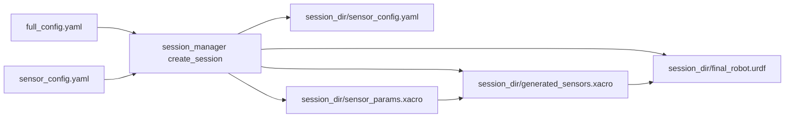

# 毫米波雷达在整体仿真中的接入路径梳理

## 结论：当前工程里“怎么插进去”

毫米波雷达**不是**在 world SDF 里手写插件块，而是与激光/相机/海事雷达一样：**在 `full_config.yaml` 的 `sensors` 里声明一条**，由 `[session_manager.py](src/usv_simulation/usv_sim_full/usv_sim_full/scripts/session_manager.py)` 生成 `generated_sensors*.xacro`，再与船体 xacro 一起 `xacro` 成 URDF，最后由 Gazebo 加载。这与 `[INTEGRATION_GUIDE_CN.md](src/usv_simulation/sensor_plugins/usv_4d_radar_gz_new/docs/INTEGRATION_GUIDE_CN.md)` 第 4 节“在模型中挂载插件”在语义上一致，只是本工程把 SDF 片段**模板化**进了 `[sensor_macros.xacro](src/usv_simulation/usv_sim_full/description/urdf/sensor_macros.xacro)` 的 `mmwave_radar_macro`（插件挂在**无 `reference` 的 `<gazebo>`** 下，避免文档第 8 节提到的 link 下插件告警与 lumping 问题）。

## 配置分工（与你的要求对齐）

| 层级      | 文件                                                                                | 内容                                                                                           | 在本工程中的落点                                                                                                                                              |
| ------- | --------------------------------------------------------------------------------- | -------------------------------------------------------------------------------------------- | ----------------------------------------------------------------------------------------------------------------------------------------------------- |
| 外参 / 标识 | `[full_config.yaml](src/usv_simulation/usv_sim_full/config/full_config.yaml)`     | `type: mmwave_radar`（或 `mmwave`）、`name`、`parent_link`、`xyz`、`rpy`、`override_topic`、`enabled` | `generate_sensors_overlay()` 生成对 `mmwave_radar_macro` 的调用；`name` 与 `namespace` 组合成 link 名 `$(arg namespace)/{name}_link`                              |
| 内参      | `[sensor_config.yaml](src/usv_simulation/usv_sim_full/config/sensor_config.yaml)` | `mmwave.default` 下 FOV、分辨率、量程、RCS、海杂波、误差开关等                                                  | `[sensor_params.xacro](src/usv_simulation/usv_sim_full/description/urdf/sensor_params.xacro)` 用 `load_yaml(...)` 读入并展开为 `mmwave_*` 属性，作为宏默认参数传入插件 XML |

**与文档参数的对应**：`sensor_config.yaml` 里 `mmwave.default` 的键与 `[INTEGRATION_GUIDE_CN.md](src/usv_simulation/sensor_plugins/usv_4d_radar_gz_new/docs/INTEGRATION_GUIDE_CN.md)` 中 `<plugin>` 子元素（如 `horizontal_fov_deg`、`max_range`、`update_rate_hz` 等）一致；`frame_id` / `radar_link_name` / `ego_link_name` **不**放在 YAML 里，而是由 xacro 根据 `name`、`parent_link` 推导（与注释一致）。

**你当前 `full_config` 中的示例**（`[full_config.yaml` 约 195–207 行](src/usv_simulation/usv_sim_full/config/full_config.yaml)）已与 `sensor_config` 注释中“与验证 SDF 对齐”的说明一致；注意**实际 ROS 话题**在生成时会带机器人命名空间前缀：`[session_manager.py` 对 mmwave 使用 `topic="/$(arg namespace)/{topic_ns}"](src/usv_simulation/usv_sim_full/usv_sim_full/scripts/session_manager.py)`，其中 `topic_ns = override_topic.lstrip('/')`，例如 `robot.name: usv_1`、`override_topic: /sensors/mmwave/mmwave_front/points` 时，插件发布话题约为 `**/usv_1/sensors/mmwave/mmwave_front/points`**（算法与 RViz 需按此前缀订阅）。

## 合并生成路径（对照海事雷达）

与海事雷达共用同一套**会话级确定性生成**流程：

1. `**sensor_config_path**`：`[full_config.yaml` 顶层 `sensor_config_path: config/sensor_config.yaml](src/usv_simulation/usv_sim_full/config/full_config.yaml)` 由 `[resolve_sensor_config_path()](src/usv_simulation/usv_sim_full/usv_sim_full/scripts/session_manager.py)` 解析（相对路径优先相对“用户传入的 full_config 所在目录”）。
2. **会话拷贝**：`[generate_session_sensor_params_xacro()](src/usv_simulation/usv_sim_full/usv_sim_full/scripts/session_manager.py)` 将 YAML 拷到 `logs/session_*/sensor_config.yaml`，并把模板 `[sensor_params.xacro](src/usv_simulation/usv_sim_full/description/urdf/sensor_params.xacro)` 中的 `$(find usv_sim_full)/config/sensor_config.yaml` **替换为会话内绝对路径**，保证每次运行内参快照固定。
3. **叠加层**：`[generate_sensors_overlay()](src/usv_simulation/usv_sim_full/usv_sim_full/scripts/session_manager.py)` 写出 `generated_sensors.xacro`：首行 `<xacro:include session_sensor_params.xacro/>`，再嵌入宏定义，最后按 `sensors` 列表实例化——海事雷达走 `maritime_radar_macro`，毫米波走 `mmwave_radar_macro`。
4. **编译 URDF**：`[compile_xacro_to_urdf()](src/usv_simulation/usv_sim_full/usv_sim_full/scripts/session_manager.py)` 对船模板传入 `has_extra_sensors` / `extra_sensors:=<叠加层路径>`（与海事雷达相同机制）。

**与海事雷达的差异（行为上）**：

- **海事雷达**：`[maritime_radar_macro](src/usv_simulation/usv_sim_full/description/urdf/sensor_macros.xacro)` 使用 `[gz_maritime_radar_plugin](src/usv_simulation/sensor_plugins/gz_maritime_radar_plugin)` 的 `MaritimeRadarPlugin`，内参来自 `sensor_config['radar']['maritime']`，中间有 `gpu_lidar` + 关节转速等；`[infra_sim.launch.py](src/usv_simulation/usv_sim_full/launch/components/infra_sim.launch.py)` 把 `**gz_maritime_radar_plugin` 的 `lib`** 加入 `GZ_SIM_SYSTEM_PLUGIN_PATH`。
- **毫米波**：`[mmwave_radar_macro](src/usv_simulation/usv_sim_full/description/urdf/sensor_macros.xacro)` 加载 `**libusv_4d_radar_plugin.so`**（包名 `**usv_4d_radar_gz`**，源码目录为 `[usv_4d_radar_gz_new](src/usv_simulation/sensor_plugins/usv_4d_radar_gz_new)`）；`[generate_bridge_config()](src/usv_simulation/usv_sim_full/usv_sim_full/scripts/session_manager.py)` 明确 **不把 mmwave 加入 ros_gz 桥**（插件直接向 ROS 2 发布 `sensor_msgs/PointCloud2`，见代码注释 “mmwave_radar plugin publishes ROS PointCloud2 directly”）。
- **插件路径**：`[infra_sim.launch.py](src/usv_simulation/usv_sim_full/launch/components/infra_sim.launch.py)` 在设置 `GZ_SIM_SYSTEM_PLUGIN_PATH` 时**同时**追加海事雷达与 `usv_4d_radar_gz` 的 `lib`，并同步到 `os.environ`，避免 `ros_gz_sim` 子进程覆盖导致找不到 `.so`（与文档第 3、8 节一致）。

## 运行时依赖（文档第 2–3 节的工程化落点）

- `**colcon build`**：`[usv_sim_full/package.xml](src/usv_simulation/usv_sim_full/package.xml)` 已 `depend` `**usv_4d_radar_gz`**，全工作区构建后插件库在 `install/usv_4d_radar_gz/lib`。
- `**GZ_SIM_SYSTEM_PLUGIN_PATH**`：由 `[infra_sim.launch.py](src/usv_simulation/usv_sim_full/launch/components/infra_sim.launch.py)` 在启动 gz 前设置，一般**无需**手工 export（若单独跑 `gz sim` 无该 launch，仍需按集成文档设置）。

## 设计层面的已知限制（扩展多颗毫米波时需注意）

- **内参 profile**：当前仅读取 `**mmwave.default`**，**所有** `mmwave_radar` 实例共享同一套内参；若需要“前雷达 / 侧雷达”不同 FOV 或量程，需要扩展 `sensor_config` 结构（例如多个 key）并在 xacro/生成脚本里按传感器名或显式字段选择——这与海事雷达当前也是“全船共用 `radar.maritime`”的模式类似。
- **话题字符串**：`override_topic` 建议保持**无机器人前缀**的路径（如 `/sensors/mmwave/...`），由生成逻辑统一加 `namespace`；若写成已带 `usv_1/...` 的形式可能产生重复前缀，需与现有生成规则一致。

## 建议验证步骤（与文档第 7 节对应）

1. `source install/setup.bash` 后启动现有 `usv_sim_full` 主 launch（使用你的 `full_config.yaml`）。
2. `ros2 topic list | grep mmwave`（或 `points`）确认带 `/<robot_name>/...` 的话题。
3. `ros2 topic echo <topic> --once` 检查 `header.frame_id` 是否为 `**{namespace}/{sensor_name}_link`**（与 TF、`output_points_in_sensor_frame=true` 一致）。

