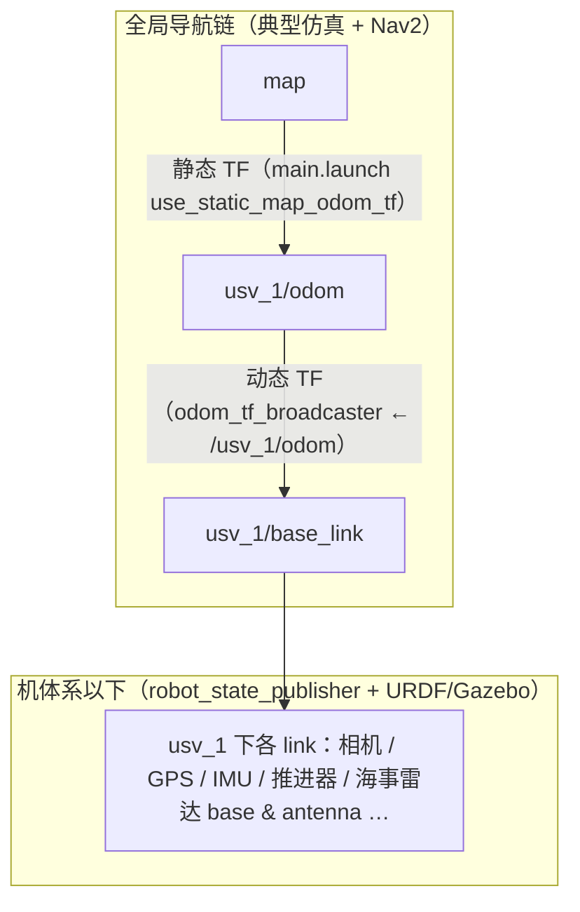
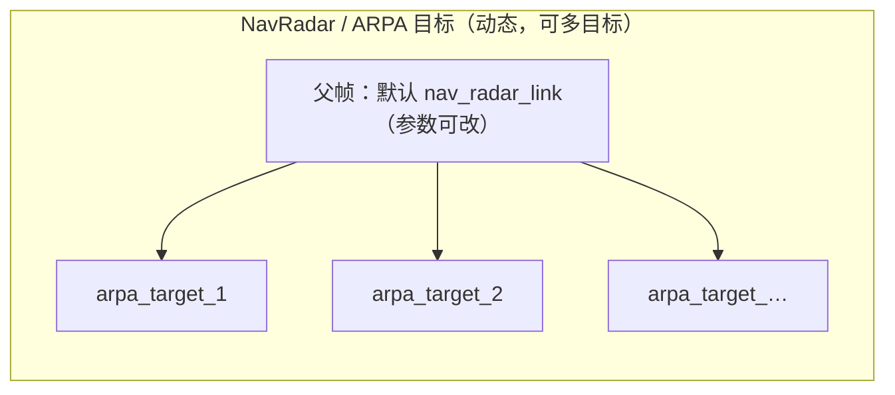

# USV_ROS 中与导航（Nav）相关的 TF 变换梳理

本文档归纳仓库内与 **Nav2 / 全局定位 / 船体里程计 / 导航雷达（NavRadar）** 相关的坐标系与 TF 发布关系，便于对照 launch 与参数调试。

**约定**：下文以单船 `usv_1` 为例；多船时帧名前缀为各自 `robot_*.name`（经 `full_config` 与 session 解析后的船名，且需满足 ROS 帧名合法字符）。

---

## 1. 核心：全局导航 TF 链（仿真主流程）

在 `main.launch.py` 默认开启 `use_static_map_odom_tf:=true` 时，会为每条船发布 **静态** `map` → `{robot}/odom`（单位变换，用于把全局 `map` 与船名前缀下的里程计帧接成一棵树，与 RViz Fixed Frame=`map`、Nav2 全局代价地图一致）。

`robot_bringup.launch.py` 中 **`odom_tf_broadcaster`** 订阅 `/{robot}/odom`（`nav_msgs/Odometry`），按消息中的 `header.frame_id` 与 `child_frame_id` 广播 **动态** TF。Gazebo 侧 `wamv_p3d.xacro` 将里程计帧配置为 `{namespace}/odom`、机体系为 `{namespace}/base_link`，因此典型链为：

`map` → `usv_1/odom` → `usv_1/base_link` →（URDF / `robot_state_publisher`）各传感器 link。

| 父坐标系 | 子坐标系 | 类型 | 主要来源 |
|---------|---------|------|----------|
| `map` | `{robot}/odom` | 静态（可选） | `tf2_ros/static_transform_publisher`（`main.launch.py`，`use_static_map_odom_tf`） |
| `{robot}/odom` | `{robot}/base_link` | 动态 | `usv_sim_full/odom_tf_broadcaster.py` ← `/{robot}/odom`（Gazebo OdometryPublisher + `ros_gz_bridge`） |
| `{robot}/base_link` | `{robot}/…`（相机、GPS、IMU、桨、海事雷达 `{name}_base_link` / `{name}_antenna_link` 等） | 以 URDF 为准；连续关节由仿真 joint 状态驱动 | `robot_state_publisher` + Gazebo 关节 |

**Nav2 帧配置**（`usv_sim_full/config/radar_nav2_param.yaml`）：全局代价地图与行为树使用 `global_frame: map`、`robot_base_frame: __ROBOT_NS__/base_link`；局部代价地图使用 `global_frame: __ROBOT_NS__/odom`。启动时 `nav2_thruster_bringup.launch.py` 将 `__ROBOT_NS__` 替换为实际船名。

**TF 话题中继**：Nav2 在命名空间下监听 `/{ns}/tf`；`tf_namespace_relay.py` 将根命名空间的 `/tf`、`/tf_static` 中继到 `/{ns}/tf`、`/{ns}/tf_static`（并合并静态 TF 快照），避免 QoS/命名空间不一致。

---

## 2. Mermaid：全局导航 TF 树（示意）



多船时在 `MAP` 下并行增加 `usv_2/odom` → `usv_2/base_link` 等分支（每条船各一组 `static_transform_publisher` + `odom_tf_broadcaster`）。

---

## 3. 导航雷达（NavRadar / ARPA）相关 TF

**`radar_tf_node`**（`gy_radar_driver`）：订阅 `NavRadarFrame`，为跟踪目标广播动态 TF。默认父帧为 `usv_interfaces::FRAME_NAVRADAR`，即常量 **`nav_radar_link`**；子帧为 `arpa_target_<目标号>`。

实际仿真中，海事雷达 URDF 链路挂在 **`{robot}/base_link`** 下（`sensor_macros.xacro` 中 `maritime_radar_macro`），扇区消息在 `robot_bringup` 里常将 `frame_id` 设为 **`{robot}/{sensor_name}_base_link`**。若要在 RViz/代价地图中正确叠加 ARPA 目标，**`radar_tf_node` 的 `parent_frame` 参数应与扇区/点云消息的 `frame_id` 一致**（见包内 `radar_params.yaml` 等覆盖项）。



---

## 4. 可选与其它模式

### 4.1 `robot_localization`（`enable_robot_localization`）

`robot_bringup.launch.py` 可启动 `navsat_transform_node` 与 **`ekf_map_node`**（参数见 `usv_sim_full/config/robot_localization_gps.yaml`）。该 EKF 配置中 `world_frame: map`、`publish_tf: true`。在 `robot_localization` 语义下，滤波器会在 **`map` 与 `{robot}/odom`、 `{robot}/base_link` 之间发布 TF**（与仿真里程计/静态 `map→odom` 可能重叠）。启用时需根据官方文档与本项目注释，**协调是否关闭 `use_static_map_odom_tf` 或关闭重复的 `odom_tf_broadcaster`**，避免多源竞争。

### 4.2 `ground_truth_sim` 静态 TF（无 Gazebo 全机仿真时）

`ground_truth_sim/static_tf_broadcaster.py` 可一次性发布 **`map` → `base_link`（参数可改）** 以及 **`base_link` → `nav_radar_link`、各相机与毫米波 link** 等静态树，用于纯真值/RViz 演示；帧名默认**不带**船名前缀，与主仿真命名空间方案不同，勿与 `usv_1/...` 混用同一套 launch 而不改参数。

### 4.3 AIS 子工程（`usv_fusion/ROS_AIS_ws-main`）

`ais_map_pub_node` 发布静态 **`{os_name}_enu` → `map`**（参数 `map_name`）；`ais_tf_node` 发布他船相对本船 ENU 的动态 TF。该树与 USV 仿真 `map` / `usv_1/odom` **不一定同一套原点定义**，联调前需核对地理参考与 `map` 语义。

---

## 5. 代码与配置索引（便于跳转）

| 内容 | 路径 |
|------|------|
| 帧常量 `FRAME_MAP` / `FRAME_NAVRADAR` 等 | `src/usv_interfaces/include/usv_interfaces/topics.hpp` |
| 静态 `map` → `{robot}/odom` | `src/usv_simulation/usv_sim_full/launch/main.launch.py` |
| `odom` → `base_link` 广播 | `src/usv_simulation/usv_sim_full/usv_sim_full/scripts/odom_tf_broadcaster.py` |
| Gazebo 里程计帧名 | `src/usv_simulation/vrx/vrx_urdf/wamv_gazebo/urdf/components/wamv_p3d.xacro` |
| Nav2 代价地图/行为 `global_frame` / `robot_base_frame` | `src/usv_simulation/usv_sim_full/config/radar_nav2_param.yaml` |
| TF 中继 | `src/usv_simulation/usv_sim_full/usv_sim_full/scripts/tf_namespace_relay.py` |
| EKF / navsat 参数 | `src/usv_simulation/usv_sim_full/config/robot_localization_gps.yaml` |
| ARPA 目标 TF | `src/usv_simulation/sensor_plugins/gy_radar_driver-main/src/radar_tf_node.cpp` |
| 演示用 `map`→`base_link`+传感器静态树 | `src/usv_simulation/ground_truth_sim/ground_truth_sim/static_tf_broadcaster.py` |

---

## 6. 验证建议

```bash
source install/setup.bash
ros2 run tf2_tools view_frames   # 生成当前 TF 树 PDF（需在仿真运行且 TF 已发布时执行）
# 或
ros2 topic echo /tf --once
```

将生成的 `frames.pdf` 与本文 Mermaid 对照，可快速发现缺失边（例如未开 `use_static_map_odom_tf` 时 `map` 与 `{robot}/odom` 不连通）。
