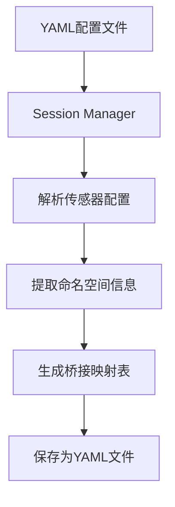

# USV_Simulation中ros_gz_bridge实现分析报告

## 🔍 系统架构概述

USV_Simulation功能包采用了多层次的`ros_gz_bridge`实现架构，通过动态配置生成和模块化启动实现了ROS 2与Gazebo Garden之间的高效数据桥接。

## 🏗️ 桥接系统架构

### 1. 双层桥接架构设计

```
┌─────────────────┐    ┌──────────────────┐    ┌─────────────────┐
│   全局桥接      │    │   传感器桥接     │    │   推进器桥接    │
│ (infra_sim)     │    │ (robot_bringup)  │    │ (动态生成)      │
│   /clock        │    │  传感器数据      │    │  控制指令       │
└─────────────────┘    └──────────────────┘    └─────────────────┘
         │                       │                       │
         ▼                       ▼                       ▼
┌─────────────────────────────────────────────────────────────┐
│              ros_gz_bridge parameter_bridge节点             │
└─────────────────────────────────────────────────────────────┘
         │
         ▼
┌─────────────────────────────────────────────────────────────┐
│                    Gazebo Garden仿真引擎                     │
└─────────────────────────────────────────────────────────────┘
```

## 📊 桥接实现详解

### 1. 全局基础设施桥接 (infra_sim.launch.py)

**文件位置**: `launch/components/infra_sim.launch.py`

```python
# 启动全局桥接节点（仅包含/clock和系统控制话题）
global_bridge_node = Node(
    package='ros_gz_bridge',
    executable='parameter_bridge',
    name='global_bridge',
    parameters=[{
        'config_file': os.path.join(get_package_share_directory('usv_sim_full'), 'config', 'global_bridge.yaml')
    }],
    output='screen'
)
```

**配置文件**: `config/global_bridge.yaml`
```yaml
- ros_topic_name: "/clock"
  gz_topic_name: "/clock"
  ros_type_name: "rosgraph_msgs/msg/Clock"
  gz_type_name: "gz.msgs.Clock"
  direction: GZ_TO_ROS
```

### 2. 动态传感器桥接 (session_manager.py)

**文件位置**: `scripts/session_manager.py`

```python
def generate_bridge_config(config_data):
    """
    根据传感器配置生成桥接配置
    """
    bridges = [
        {
            "ros_topic_name": "/clock",
            "gz_topic_name": "/clock",
            "ros_type_name": "rosgraph_msgs/msg/Clock",
            "gz_type_name": "gz.msgs.Clock",
            "direction": "GZ_TO_ROS"
        }
    ]
    
    # 添加遥测配置
    if config_data.get('visualization', {}).get('enable_telemetry', True):
        bridges.append({
            "ros_topic_name": f"/model/{sanitized_bridge_ns}/odometry",
            "gz_topic_name": f"/model/{sanitized_bridge_ns}/odometry",
            "ros_type_name": "nav_msgs/msg/Odometry",
            "gz_type_name": "gz.msgs.Odometry",
            "direction": "GZ_TO_ROS"
        })
        # ... 其他遥测桥接
    
    # 添加传感器桥接
    sensors_config = config_data.get('sensors', {})
    # ... 处理各种传感器类型
    
    return bridges
```

### 3. 机器人专属桥接 (robot_bringup.launch.py)

**文件位置**: `launch/components/robot_bringup.launch.py`

```python
# 启动机器人专属的传感器桥接节点
sensor_bridge_node = Node(
    package='ros_gz_bridge',
    executable='parameter_bridge',
    name='sensor_bridge',
    parameters=[{
        'config_file': bridge_config_path,
        'use_sim_time': use_sim_time
    }],
    output='screen'
)
```

## 🎯 桥接配置生成流程

### 1. 配置解析阶段


### 2. 动态配置生成
```python
# 从配置中提取命名空间
robot_name_for_bridge = config_data.get('robot', {}).get('name', 'wamv')
sanitized_bridge_ns = re.sub(r"[^A-Za-z0-9_\-]", '_', str(robot_name_for_bridge))

# 生成传感器桥接配置
for lidar in lidars:
    if lidar.get('enabled', True):
        topic = lidar.get('topic', f'/sensors/lidar/{lidar["name"]}/points')
        ros_topic = '/' + sanitized_bridge_ns + '/' + topic.lstrip('/')
        gz_topic = topic.replace('/sensors/', f'/world/sydney_regatta/model/{sanitized_bridge_ns}/sensor/')
        
        bridges.append({
            "ros_topic_name": ros_topic,
            "gz_topic_name": gz_topic,
            "ros_type_name": "sensor_msgs/msg/PointCloud2",
            "gz_type_name": "gz.msgs.PointCloudPacked",
            "direction": "GZ_TO_ROS"
        })
```

### 3. 多命名空间支持
```python
# 为两种常见命名空间都添加桥接配置
thrusters_config = config_data.get('robot', {}).get('thrusters', {})
if thrusters_config.get('enabled', True):
    namespaces = [sanitized_bridge_ns, 'wamv']  # 双重命名空间支持
    
    for ns in namespaces:
        bridges.append({
            "ros_topic_name": f"/{ns}/thrusters/left/thrust",
            "gz_topic_name": f"/model/{sanitized_bridge_ns}/joint/left_engine_propeller_joint/cmd_vel",
            "ros_type_name": "std_msgs/msg/Float64",
            "gz_type_name": "gz.msgs.Double",
            "direction": "ROS_TO_GZ"
        })
```

## 🔄 数据流向分析

### 1. 传感器数据流 (GZ_TO_ROS)
```
Gazebo传感器 → ros_gz_bridge → ROS 2话题

示例:
/world/sydney_regatta/model/usv_sim_full/sensor/lidar/points
    ↓ (Bridge)
/usv_sim_full/sensors/lidar/front/points
```

### 2. 控制指令流 (ROS_TO_GZ)
```
ROS 2话题 → ros_gz_bridge → Gazebo关节控制

示例:
/usv_sim_full/thrusters/left/thrust
    ↓ (Bridge)
/model/usv_sim_full/joint/left_engine_propeller_joint/cmd_vel
```

### 3. 时间同步流 (GZ_TO_ROS)
```
Gazebo时钟 → ros_gz_bridge → ROS 2时钟

/clock (Gazebo) → /clock (ROS 2)
```

## ⚙️ 桥接参数配置

### 1. 消息类型映射
```python
message_mappings = {
    # 传感器数据
    "sensor_msgs/msg/PointCloud2": "gz.msgs.PointCloudPacked",
    "sensor_msgs/msg/Image": "gz.msgs.Image",
    "sensor_msgs/msg/CameraInfo": "gz.msgs.CameraInfo",
    "sensor_msgs/msg/Imu": "gz.msgs.IMU",
    "sensor_msgs/msg/NavSatFix": "gz.msgs.NavSat",
    
    # 控制指令
    "std_msgs/msg/Float64": "gz.msgs.Double",
    
    # 遥测数据
    "nav_msgs/msg/Odometry": "gz.msgs.Odometry",
    "sensor_msgs/msg/JointState": "gz.msgs.Model",
    "tf2_msgs/msg/TFMessage": "gz.msgs.Pose_V",
    
    # 系统消息
    "rosgraph_msgs/msg/Clock": "gz.msgs.Clock"
}
```

### 2. 桥接方向配置
```python
direction_mapping = {
    "GZ_TO_ROS": "从Gazebo到ROS的数据流",
    "ROS_TO_GZ": "从ROS到Gazebo的控制流",
    "BIDIRECTIONAL": "双向数据交换"
}
```

## 🛠️ 启动时序分析

### 1. 系统启动流程
```
1. infra_sim.launch.py 启动
   ├── 启动Gazebo仿真环境
   └── 启动全局桥接节点 (/clock)

2. robot_bringup.launch.py 启动
   ├── 生成URDF模型
   ├── Session Manager生成桥接配置
   └── 启动传感器桥接节点

3. visualization.launch.py 启动
   └── 启动RViz可视化
```

### 2. 桥接节点生命周期
```
启动阶段:
- 加载配置文件
- 建立网络连接
- 注册话题订阅/发布

运行阶段:
- 实时数据转发
- 消息类型转换
- 错误处理和重连

停止阶段:
- 清理话题连接
- 释放网络资源
- 保存运行日志
```

## 📈 性能优化策略

### 1. 按需桥接
```python
# 只为启用的传感器生成桥接配置
if sensor.get('enabled', True):
    # 生成桥接配置
    pass
else:
    # 跳过该传感器
    continue
```

### 2. 命名空间隔离
```python
# 使用机器人命名空间避免话题冲突
ros_topic = '/' + sanitized_bridge_ns + '/' + topic.lstrip('/')
```

### 3. 配置缓存
```python
# 会话期间复用生成的配置
session_info = {
    "urdf_path": urdf_path,
    "bridge_yaml_path": bridge_yaml_path,
    "rviz_config_path": rviz_config_path
}
```

## 🔧 调试和监控

### 1. 桥接状态检查
```bash
# 查看桥接节点
ros2 node list | grep bridge

# 查看桥接参数
ros2 param list | grep bridge

# 监控话题流量
ros2 topic hz /usv_sim_full/sensors/lidar/front/points
```

### 2. 日志分析
```bash
# 查看桥接日志
ros2 run ros_gz_bridge parameter_bridge --ros-args --log-level debug

# 检查生成的配置文件
cat logs/session_*/bridge_config.yaml
```

## 🎯 关键技术特点

### 1. **动态配置生成**
- 基于YAML配置文件自动生成桥接映射
- 支持运行时传感器配置修改
- 无需手动维护桥接配置文件

### 2. **多命名空间支持**
- 同时支持自定义命名空间和兼容命名空间
- 实现新旧系统的平滑过渡
- 避免话题命名冲突

### 3. **模块化架构**
- 基础设施桥接与传感器桥接分离
- 每个机器人实例拥有独立的桥接节点
- 便于调试和故障隔离

### 4. **类型安全转换**
- 严格的ROS消息类型与Gazebo消息类型映射
- 自动处理基本数据类型转换
- 提供详细的错误信息

这种实现方式使得USV_Simulation能够灵活适应不同的仿真需求，同时保持了系统的可维护性和扩展性。
