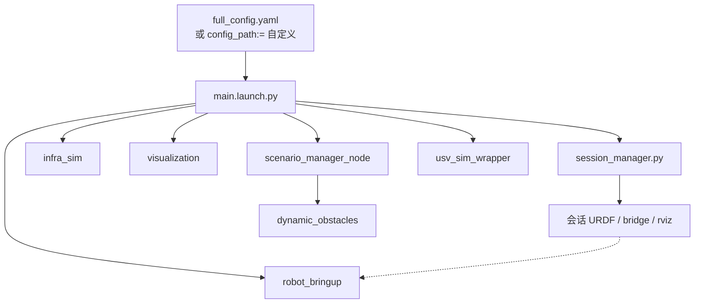
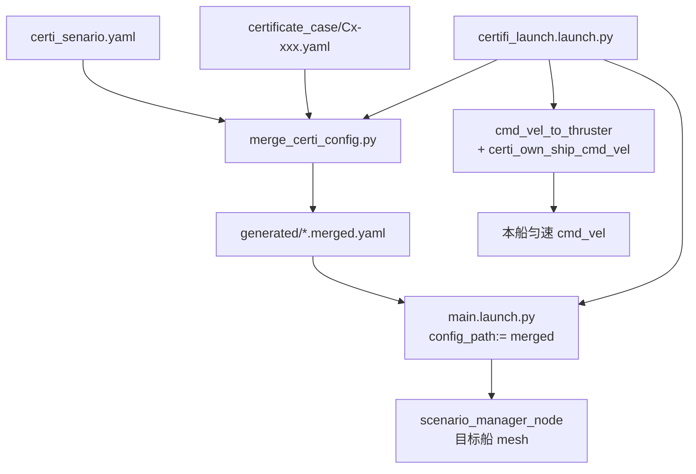
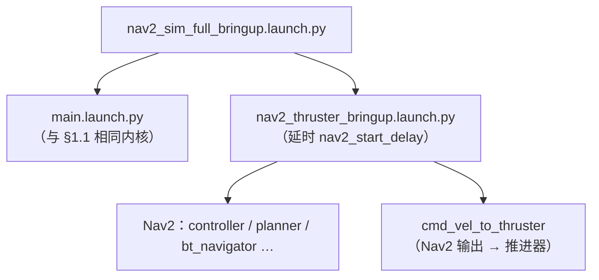
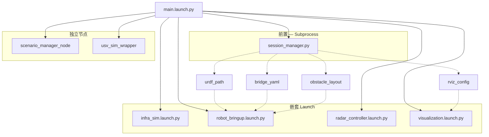

# Quick Start（用户向）

**定位**：`docs_v3` 下的快速上手文档。历史分册见 [`docs_v1/README.md`](../docs_v1/README.md)；仓库与包职责见 [`仿真仓库结构说明.md`](./仿真仓库结构说明.md)；工作区根入口 [`README.md`](../../../../README.md)。

**阅读顺序**

| 步骤 | 章节 | 你要做的事 |
|------|------|------------|
| 1 | **§0 环境** | Docker 或本机完成首次编译 |
| 2 | **§1 架构** | 理解仿真内核与三种 launch 层级（main / certifi / Nav2 bringup） |
| 3 | **§2 怎么跑** | 选 launch 启动 Gazebo |
| 4 | **§3 怎么配** | 改 YAML（整机或认证 case） |
| 5 | **§4 怎么接数据** | 算法订阅/发布话题 |

终端默认已做降噪；需完整 INFO 排障时见 **[终端输出与日志降噪.md](./终端输出与日志降噪.md)**（含 `verbose_launch:=true`）。

---

## 0) 环境与首次编译

仿真栈依赖 **ROS 2 Humble** 与 **Gazebo Harmonic（gz）**；版本矩阵见仓库根 [`README.md`](../../../../README.md)。**Docker 或本机二选一**。

### 0.1 Docker 前置

1. 安装 **Docker Engine / Desktop**，当前用户可执行 `docker run`。
2. 能访问 **Docker Hub**（或镜像加速），可 `docker pull xyjy949/humble2harmonic`。
3. 将仓库克隆到宿主机 `USV_ROS`，容器内 `-v` 挂载到 `/workspace`。

**GUI（RViz / Gazebo）**：除 `--network host` 外通常需 X11 或 GPU 参数，见 [`docker/README.md`](../../docker/README.md)。

### 0.2 路线 A：Docker（推荐复现环境）

```bash
docker pull xyjy949/humble2harmonic:latest

docker run -it --rm \
  --network host \
  -v /path/to/USV_ROS:/workspace \
  -w /workspace \
  xyjy949/humble2harmonic:latest \
  bash
```

需要 **Nav2 全栈** 时，容器内安装 `ros-humble-navigation2`，或使用镜像 **`xyjy949/humble2harmonic:nav2`**（见 [`docker/Dockerfile.humble2harmonic_nav2`](../../docker/Dockerfile.humble2harmonic_nav2)）。

容器内执行 **§0.4 编译**，再进入 **§1** 了解架构、**§2** 启动。

### 0.3 路线 B：本机开发

**前置**（通常 Ubuntu 22.04）：ROS 2 Humble、`Gazebo Harmonic`、`ros-humble-ros-gzharmonic` 等（可参考 [`docker/Dockerfile`](../../docker/Dockerfile) 的 apt 步骤）。

```bash
cd /path/to/USV_ROS
source /opt/ros/humble/setup.bash
sudo apt update
rosdep install --from-paths src/usv_interfaces src/usv_simulation --ignore-src -r -y
./scripts/clean_build.sh --packages-up-to usv_sim_full
source install/setup.bash
```

### 0.4 首次编译小结

| 步骤 | 说明 |
|------|------|
| `source /opt/ros/humble/setup.bash` | ROS 2 基础环境 |
| `rosdep install --from-paths src/usv_interfaces src/usv_simulation …` | 系统依赖 |
| `./scripts/clean_build.sh --packages-up-to usv_sim_full` | 递归编译 `usv_sim_full` 及其 `package.xml` 依赖（含海事雷达链路等） |
| `source install/setup.bash` | 加载工作区 overlay |

若挂载目录带有**宿主编译过的** `build/` / `install/`，请先 `rm -rf build install log` 再编译，避免 CMake 路径错乱。

---

## 1) 架构概览

仿真栈以 **`usv_sim_full`** 为编排中心：YAML 驱动 → `session_manager` 生成 URDF/桥接/RViz → Gazebo Harmonic + `ros_gz_*` 桥接 → ROS 2 话题。

### 1.1 日常全流程：`main.launch.py`



| 项 | 说明 |
|----|------|
| **用途** | 日常开发、多船、传感器全链路、可选 `ground_truth_sim` |
| **主配置** | `config/full_config.yaml`（或 `config_path:=`） |
| **本船控制** | 默认无自动航向；遥控（§2.3）、自写节点，或外层再叠 Nav2（§1.3） |

### 1.2 认证会遇：`certifi_launch.launch.py`



| 项 | 说明 |
|----|------|
| **用途** | 标准会遇局面（41 个 case，C1～C4） |
| **主配置** | 基底 + case → 合并产物 |
| **与 main 关系** | 先合并 YAML，再 **Include `main.launch.py`**，走同一套 Gazebo / 传感器 / 桥接 |
| **本船控制** | launch 内强制 **`certi_own_ship_cmd_vel`** 匀速链（非 Nav2） |

### 1.3 `nav2_sim_full_bringup` 与上面两条的关系

**不是第三条并列的「配置入口」**，而是在 **`main.launch.py` 之上再叠一层 Nav2 导航栈** 的编排 launch。



| Launch | 包含什么 | 默认配置 | 本船谁发 cmd_vel |
|--------|----------|----------|------------------|
| **`main.launch.py`** | 仅仿真（Gazebo、传感器、场景） | `full_config.yaml` | 无（需遥控或外部节点） |
| **`certifi_launch.launch.py`** | 合并 case → **Include main** + 认证匀速链 | merged YAML | **`certi_own_ship_cmd_vel`** |
| **`nav2_sim_full_bringup.launch.py`** | **Include main** + 延时 **Include nav2_thruster_bringup** | `full_config.yaml` | **Nav2 → cmd_vel_to_thruster** |

要点：

1. **`main.launch.py` 是公共内核**：`certifi_launch` 与 `nav2_sim_full_bringup` 都是通过 `IncludeLaunchDescription` 调用它，而不是各自重写 Gazebo/传感器逻辑。
2. **Nav2 栈只挂在 `nav2_sim_full_bringup` 上**；直接 `main.launch.py` 或 `certifi_launch` **不会**自动启动 Nav2。
3. **认证场景一般不用 `nav2_sim_full_bringup`**：本船已由 `certi_own_ship_cmd_vel` 定速；若再叠 Nav2，会与认证 cmd_vel 链竞争（两套都会拉 `cmd_vel_to_thruster`）。
4. **`nav2_sim_full_bringup` 也不走 case 合并**：默认仍读 `full_config.yaml`；若要对 merged 配置跑 Nav2，需手动传 `config_path:=…merged.yaml`（少见，且需自行处理与认证匀速链的冲突）。

启动示例（§2.6）：

```bash
ros2 launch usv_sim_full nav2_sim_full_bringup.launch.py
# 等价于：先 main.launch（full_config），约 25 s 后 nav2_thruster_bringup（usv_1）
```

### 1.4 `main.launch.py` 内部组装（简图）



**深入说明**：[`usv_sim_full/launch/notes.md`](../../usv_sim_full/launch/notes.md)（各 launch 职责、`config_path` 约定）。

### 1.5 配置与代码索引

| 主题 | 文档 / 路径 |
|------|-------------|
| `config/` 各 YAML 谁读 | [`usv_sim_full/config/notes_config.md`](../../usv_sim_full/config/notes_config.md) |
| 字段带注释参考 | `config/full_config.reference.yaml`（默认不被 launch 加载） |
| 认证 case 规则表 | [`certificate_case/senario_cule.md`](../../usv_sim_full/config/certificate_case/senario_cule.md) |
| 认证 case 索引与格式 | [`certificate_case/README.md`](../../usv_sim_full/config/certificate_case/README.md) |
| 包内目录树 | [`usv_sim_full/docs/仓库结构说明.md`](../../usv_sim_full/docs/仓库结构说明.md) |

---

## 2) 怎么跑

以下命令均假设 **§0** 已完成，且当前 shell 已 `source install/setup.bash`。

### 2.1 日常全流程仿真

```bash
cd /path/to/USV_ROS
source install/setup.bash
ros2 launch usv_sim_full main.launch.py
```

默认加载 `config/full_config.yaml`（多船、传感器、可选 `ground_truth_sim` 等）。换配置：

```bash
ros2 launch usv_sim_full main.launch.py config_path:=/path/to/your_config.yaml
```

**常见控制台提示（多数非故障）**

- **`libEGL … failed to create dri2 screen`**：无 GPU / 远程无 GL；仿真仍可跑。
- **Gazebo `gz_frame_id` / `frame_id` … not defined in SDF**：URDF→SDF 保留的 ros_gz 标签，可忽略。
- **`kdl_parser` 根连杆带惯性**：WAM-V URDF 习惯，一般可忽略。
- **`RecvSrvRequest() … Host unreachable`**：gz-transport 发现/网络问题；单实例、`unset GZ_IP IGN_IP` 后重试。
- **`adaptive_radar_grid_map_node` `[MAP RESET]`**：雷达栅格扩展，信息级日志。

### 2.2 认证会遇仿真（`certifi_launch`）

用于 **标准会遇局面**（对遇、交叉、追越、多船干扰等）。语义来自 [`senario_cule.md`](../../usv_sim_full/config/certificate_case/senario_cule.md)，共 **41** 个 case（C1-001～C4-011）。

#### 启动命令

```bash
source install/setup.bash

# 默认：C1-001 危险对遇
ros2 launch usv_sim_full certifi_launch.launch.py

# 指定 case
ros2 launch usv_sim_full certifi_launch.launch.py \
  case_config:=src/usv_simulation/usv_sim_full/config/certificate_case/C1-003.yaml

# 安装路径（colcon 后）
ros2 launch usv_sim_full certifi_launch.launch.py \
  case_config:=$(ros2 pkg prefix usv_sim_full)/share/usv_sim_full/config/certificate_case/C4-001.yaml
```

#### Launch 参数

| 参数 | 默认 | 说明 |
|------|------|------|
| `base_config` | `certi_senario.yaml` | 认证基底（单船、全传感器、`sydney_regatta_open_water`） |
| `case_config` | `certificate_case/C1-001.yaml` | 会遇语义 YAML |
| `merged_config` | （空） | 合并输出路径；空则写入 `config/generated/<scenario_id>.merged.yaml` |
| `robot_namespace` | （空） | 本船命名空间；空则从 merged 的 `robot_1.name` 读取（默认 `usv_1`） |
| `thrust_chain_delay` | `3.0` | Gazebo spawn 后延时启动本船 cmd_vel 链（秒） |
| `verbose_launch` | `false` | `true` 时 thrust 链等输出到终端 |

#### 运行时行为

1. **`merge_certi_config.py`**（launch 内同步调用）：深合并 `base_config` + `case_config` → 写入 merged YAML。
2. **`main.launch.py`**：以 merged 为 `config_path`，启动 Gazebo、本船 URDF/传感器、RViz（基底默认开启）。
3. **`scenario_manager_node`**：按 merged 中 `scenario.dynamic_obstacles` 用 **`ros_gz_sim create`** 插入目标船（`mesh_profile`），沿航路点匀速运动；C3 依次会遇支持 **`spawn_delay_sec`** 延迟生成第二艘。
4. **本船匀速链**（`certifi_launch` 强制拉起，不依赖 Nav2）：
   - `cmd_vel_to_thruster`：船体系 `cmd_vel` → 双推进器推力/舵角
   - `certi_own_ship_cmd_vel`：按 case 中 `own_ship` 发布恒定航速/航向；若检测到其他节点也在发同船 `cmd_vel`（`count_publishers > 1`），则**退让停发**，便于算法接管

#### 场景类别速查

| 类别 | 编号 | 含义 |
|------|------|------|
| **C1** | C1-001～010 | 单目标船：危险/非危险 对遇、右/左交叉、追越、被追越 |
| **C2** | C2-001～005 | 危险主目标 + 非危险干扰船 |
| **C3** | C3-001～015 | 两艘危险船**依次**会遇（第二艘 `spawn_delay_sec`） |
| **C4** | C4-001～011 | 两艘危险船**同时**会遇 |

#### 合并校验（不启动 Gazebo）

```bash
python3 src/usv_simulation/usv_sim_full/tools/merge_certi_config.py \
  --case src/usv_simulation/usv_sim_full/config/certificate_case/C1-001.yaml
```

成功时打印各目标船的会遇距离、DCPA、TCPA、spawn 航向。

#### 算法接管本船

认证默认由 `certi_own_ship_cmd_vel` 匀速驱动。算法接入时向 **`/{robot_ns}/cmd_vel`** 发布即可；检测到其他发布者时认证节点会自动退让。也可手动结束认证节点后再发：

```bash
ros2 node list | grep certi_own_ship
# 记下完整名后 kill，或依赖 count_publishers 退让逻辑直接发布 cmd_vel
```

推进器话题仍为 `/{robot_ns}/thrusters/left|right/{thrust,pos}`（与 §2.3 一致）。

### 2.3 键盘遥控本船双推进器

Gazebo 已启动且 `robot_1.name` 为 `usv_1` 时，**另开终端**：

```bash
source install/setup.bash
ros2 run usv_sim_full dual_thruster_teleop_incre
```

向 `/usv_1/thrusters/left|right/{thrust,pos}` 发布；**空格**急停，**Ctrl+C** 退出。认证场景下若同时运行 `certi_own_ship_cmd_vel`，遥控与之竞争推进器指令，建议测试遥控时勿启认证匀速链或停掉 `certi_own_ship_cmd_vel`。

### 2.4 传感器位姿微调（Dry Run：无 Gazebo）

```bash
ros2 launch usv_sim_full sensor_tune.launch.py
```

### 2.5 毫米波最小验证

```bash
ros2 launch usv_sim_full main.launch.py \
  config_path:=$(ros2 pkg prefix usv_sim_full)/share/usv_sim_full/config/mmwave_sydney_minimal.yaml
```

验证点云：

```bash
ros2 topic echo /usv_1/sensors/mmwave/mmwave_front/points --qos-reliability best_effort --once
```

### 2.6 仿真 + Nav2 全栈（`nav2_sim_full_bringup`）

这是 **§1.3** 中的 Nav2 编排入口：内部 **Include `main.launch.py`**，延时后再 **Include `nav2_thruster_bringup.launch.py`**。环境与镜像见 **§0.2** 与 [`docker/README.md`](../../docker/README.md)。

```bash
source install/setup.bash
ros2 launch usv_sim_full nav2_sim_full_bringup.launch.py
```

常用参数：`nav2_namespace:=usv_1`（须与 `full_config` 中船名一致）、`nav2_start_delay:=25.0`（等 Gazebo/TF 稳定）、`config_path:=…`（换整机 YAML）。默认 Nav2 参数见 `config/radar_nav2_param.yaml`。

预装 Nav2 镜像构建：

```bash
docker build -f src/usv_simulation/docker/Dockerfile.humble2harmonic_nav2 \
  -t xyjy949/humble2harmonic:nav2 .
```

---

## 3) 怎么配

### 3.1 日常整机：`full_config.yaml`

路径：`src/usv_simulation/usv_sim_full/config/full_config.yaml`

#### 字段总览（按路径）

| 字段路径 | 含义 |
|---|---|
| `environment.world_name` | Gazebo 世界名（例：`sydney_regatta`） |
| `sensor_config_path` | 传感器内参 YAML（相对 `full_config.yaml` 目录） |
| `robot_N.name` | 第 N 艘船名 / 命名空间 |
| `robot_N.spawn_pose` | 初始位姿 `[x, y, z, roll, pitch, yaw]` |
| `robot_N.sensors[]` | 传感器列表（`type`：`lidar`/`camera`/`imu`/`gps`/`maritime_radar`/`mmwave_radar`） |
| `robot_N.overrides.mass` | 船体质量（kg） |
| `obstacles.fixed_list[]` | 静态障碍 |
| `scenario.dynamic_obstacles[]` | 动态障碍（航路点巡逻；认证合并后由此注入目标船） |
| `scenario.ground_truth_sim.*` | 周邻 CTRV 真值（`/sim/ground_truth`）；认证管线合并时**强制 `enabled: false`** |
| `visualization.launch_rviz` | 是否启动 RViz |

完整字段与 `ground_truth_sim` 细节见 [`config/notes_config.md`](../../usv_sim_full/config/notes_config.md) 与 **`full_config.reference.yaml`**。

#### 加传感器（最小示例）

```yaml
- name: lidar_left
  type: lidar
  parent_link: base_link
  xyz: [0.6, 0.4, 1.7]
  rpy: [0.0, 0.0, 0.0]
  enabled: true
```

`override_topic` 不含船名前缀；最终话题为 `/{robot.name}` + 去掉首 `/` 后的路径。

#### 动态障碍（手写，非认证 case）

```yaml
- name: patrol_boat_3
  shape: cylinder
  size: [0.5, 1.0]
  color: Yellow
  speed: 1.5
  loop: true
  waypoints:
    - [10.0, 0.0]
    - [20.0, 0.0]
```

`waypoints` 至少 2 个点才会移动；`shape: mesh_profile` 时配 `mesh_profile` 路径（见 reference）。

### 3.2 认证会遇：三层配置

```text
certi_senario.yaml          ← 基底（单船、世界、传感器、RViz）
        +
certificate_case/Cx.yaml    ← 会遇语义（本船/目标船 DCPA、TCPA、局面类型）
        │
        ▼ merge_certi_config.py
generated/Cx.merged.yaml    ← 运行时 full_config 兼容产物（勿手改）
        │
        ▼ certifi_launch → main.launch.py
Gazebo + 目标船 dynamic_obstacles + certificate_runtime
```

| 文件 | 作用 |
|------|------|
| **`certi_senario.yaml`** | 认证专用基底：单船 `robot_1`、全传感器、`sydney_regatta_open_water`、无 `robot_2`、无 CTRV 真值 |
| **`certificate_case/*.yaml`** | 局面描述：见下表 |
| **`generated/*.merged.yaml`** | 合并产物；含 `scenario.dynamic_obstacles`、`certificate_runtime.own_ship_velocity` |

#### Case YAML 格式（推荐）

```yaml
scenario_id: C1-001
description: 危险对遇

own_ship:
  initial_speed_knots: 10.0
  initial_heading_deg: 0.0

target_ships:
  - id: TS1
    type: head_on              # head_on | crossing_right | crossing_left | overtaking | overtaken
    is_dangerous: true
    target_dcpa_meters: 5.0
    target_tcpa_seconds: 10.0
    speed_knots: 14.0
    encounter_range_max_m: 50.0
```

**会遇距离**：默认 `min((本船速+目标速)×target_tcpa_seconds, encounter_range_max_m)`；也可直接设 `encounter_range_m`。

**多船**：C3/C4 在 `target_ships` 中列两艘；C3 第二艘加 `spawn_delay_sec`；`sequence_index` 用于空间错开。

**批量生成 / 改默认参数**：

```bash
python3 src/usv_simulation/usv_sim_full/tools/generate_certificate_cases.py
```

工具脚本：`tools/merge_certi_config.py`（合并+几何校验）、`tools/generate_certificate_cases.py`（按规则表写 41 个 case）。

---

## 4) 怎么接数据（算法层 ROS 2 话题）

核心规则：

1. 传感器按 `usv_interfaces` 模板生成话题。
2. 配置了 `override_topic` 时优先用覆盖值。
3. 桥接后最终话题带机器人前缀：`/{robot.name}{resolved_topic}`。

### 4.1 模板映射（`usv_interfaces/topics.py`）

| 类型 | 模板 |
|---|---|
| Camera | `/sensors/camera/{sensor_name}/image_raw` |
| Lidar | `/sensors/lidar/{sensor_name}/points` |
| mmWave | `/sensors/mmwave/{sensor_name}/points` |
| GPS | `/sensors/gps/{sensor_name}/fix` |
| IMU | `/sensors/imu/{sensor_name}/data` |

### 4.2 示例（`robot_1.name = usv_1`）

| 传感器名 | 最终话题 |
|---|---|
| `front_lidar` | `/usv_1/sensors/lidar/front_lidar/points` |
| `front_cam` | `/usv_1/sensors/camera/front_cam/image_raw` |
| `imu_sensor` | `/usv_1/sensors/imu/imu_sensor/data` |
| `mari_radar` | `/usv_1/sensors/radar/nav/sector` |

### 4.3 算法常用读写

**读（订阅）**

| 话题 | 说明 |
|---|---|
| `/usv/state/vessel` | 融合状态（`usv_sim_wrapper`） |
| `/usv_1/sensors/lidar/front_lidar/points` | 激光点云（名以配置为准） |
| `/model/usv_1/odometry` | 仿真里程计 |
| `/tf`、`/tf_static` | 坐标变换 |

**写（发布）**

| 话题 | 说明 |
|---|---|
| `/usv_1/thrusters/left|right/{thrust,pos}` | 双推进器（直接控制） |
| `/usv_1/cmd_vel` | 船体速度（需 `cmd_vel_to_thruster` 或等价转换；认证 launch 已带） |

认证场景下 **`certificate_runtime.own_ship_velocity`** 写入 merged YAML，供 `certi_own_ship_cmd_vel` 读取本船目标航速/航向。

建议在算法层引用 **`usv_interfaces/topics.py`** 常量，避免硬编码字符串。

---

## 附录 A：可选 `world_name`

`environment.world_name` 对应 `usv_sim_full/worlds/` 下 SDF，例如：

- `sydney_regatta`、`sydney_regatta_open_water`（认证默认）
- `navigation_task`、`stationkeeping_task`、`ocean`
- `acoustic_perception_task`、`perception_task`、`wayfinding_task`
- 其余见 `worlds/*.sdf`

---

## 附录 B：认证相关源码速查

| 组件 | 路径 |
|------|------|
| 认证 launch | `usv_sim_full/launch/certifi_launch.launch.py` |
| 合并脚本 | `usv_sim_full/tools/merge_certi_config.py` |
| Case 生成 | `usv_sim_full/tools/generate_certificate_cases.py` |
| 目标船场景 | `usv_sim_full/scripts/scenario_manager_node.py` |
| 本船匀速 | `usv_sim_full/scripts/certi_own_ship_cmd_vel.py` |
| cmd_vel→推进器 | `usv_sim_full/scripts/cmd_vel_to_thruster.py` |
| 目标船模型 | `description/models/target_ship/10m_mesh_profile.yaml` |
