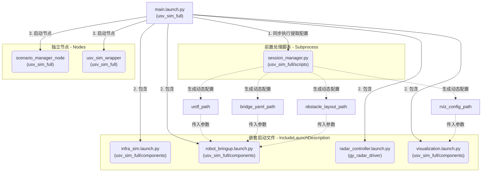

# Quick Start (User-Facing, Minimal)

**定位**：docs_v3 下的 Quick Start（与 docs_v2 内容对齐时可择一为主）。历史分册见 [`docs_v1/README.md`](../docs_v1/README.md)；目录与包职责见 [`仿真仓库结构说明.md`](./仿真仓库结构说明.md)。工作区根入口：[`README.md`](../../../../README.md)。

**阅读顺序**：先完成 **§0 环境（Docker 或本机）** 与 **首次编译**，再 **§1 启动仿真（怎么跑）**，需要改场景时看 **§2 配置（怎么配）**，对接算法时看 **§3 话题（怎么接数据）**。

本页回答：`从哪跑`（环境）→ **`怎么跑`** → **`怎么配`** → **`怎么接数据`**。

---

## 0) 环境与入口：Docker 或本机

仿真栈依赖 **ROS 2 Humble** 与 **Gazebo Harmonic（gz）**；具体版本与支持矩阵见仓库根 [`README.md`](../../../../README.md)。下面两条路线二选一即可。

### 0.1 使用 Docker 时的前置条件

1. **安装 Docker**  
   - Linux：安装 **Docker Engine**（或 **Docker Desktop for Linux**），保证当前用户可执行 `docker` / `docker run`（必要时加入 `docker` 用户组并重新登录）。  
   - Windows / macOS：安装 **Docker Desktop**，启用与 Linux 容器的集成。

2. **能拉取镜像（网络）**  
   - 需能访问 **Docker Hub**（`docker pull xyjy949/humble2harmonic` 等），或已配置 **镜像加速 / 私有 Registry 代理**，否则 `pull` 会超时失败。  
   - 企业网络若拦截 Hub，请向网管申请放行或使用内部镜像同步。

3. **工作区代码**  
   - 将本仓库克隆到宿主机路径（下文记为 `USV_ROS`），容器内通过 **`-v` 挂载** 到 `/workspace`（或你自定义的目录），以便在容器里 `colcon build` 与宿主编辑源码同步。

**GUI（RViz / Gazebo 窗口）**：除 `--network host` 外，通常还需 **X11** 或 **GPU** 相关参数；完整示例见 [`docker/README.md`](../../docker/README.md)。

### 0.2 路线 A：用 Docker 跑（推荐做环境复现）

1. **拉取基础镜像**（已含 Humble + Harmonic 相关环境，见 Hub 说明）：

   ```bash
   docker pull xyjy949/humble2harmonic:latest
   ```

2. **启动交互容器**（将 `USV_ROS` 换成你的仓库根路径）：

   ```bash
   docker run -it --rm \
     --network host \
     -v /path/to/USV_ROS:/workspace \
     -w /workspace \
     xyjy949/humble2harmonic:latest \
     bash
   ```

   - 需要 **Nav2 全栈**（`nav2_sim_full_bringup.launch.py`）时，基础镜像默认未装 Nav2，可在 **进入容器后** 执行一次：  
     `apt-get update && apt-get install -y ros-humble-navigation2 python3-colcon-common-extensions python3-rosdep`  
     或直接使用仓库构建的 **`xyjy949/humble2harmonic:nav2`**（见 [`Dockerfile.humble2harmonic_nav2`](../../docker/Dockerfile.humble2harmonic_nav2) 与 [`docker/README.md`](../../docker/README.md)）。

3. **在容器内完成首次编译**（与 §0.4 相同命令；若挂载目录里带有**宿主编译过的** `build/` / `install/`，请先清理以免 CMake 路径错乱）：

   ```bash
   source /opt/ros/humble/setup.bash
   apt-get update
   rosdep install --from-paths src/usv_interfaces src/usv_simulation --ignore-src -r -y
   rm -rf build install log
   ./scripts/clean_build.sh --packages-up-to usv_sim_full
   source install/setup.bash
   ```

4. **开始仿真**：跳到 **§1**（例如 `ros2 launch usv_sim_full main.launch.py`）。

可选：`docker/` 下 [`entrypoint.sh`](../../docker/entrypoint.sh) 可在自定义镜像里用于自动 `source` 工作区 overlay；详见 [`docker/README.md`](../../docker/README.md)。

### 0.3 路线 B：不用 Docker（本机直接开发）

**前置**（与仓库支持矩阵一致，通常为 **Ubuntu 22.04**）：

- 安装 **ROS 2 Humble**（`desktop` 或 `desktop-full`，以你团队为准）。  
- 安装 **Gazebo Harmonic** 与 **`ros-humble-ros-gzharmonic`** 等桥接包（可参考 [`docker/Dockerfile`](../../docker/Dockerfile) 中的 apt 步骤，在本机执行等价安装）。  
- 网络可访问 **Ubuntu apt 源** 与 **packages.ros.org**，以便 `rosdep` / `apt` 安装依赖。

**步骤**：

```bash
cd /path/to/USV_ROS
source /opt/ros/humble/setup.bash
sudo apt update
rosdep install --from-paths src/usv_interfaces src/usv_simulation --ignore-src -r -y
./scripts/clean_build.sh --packages-up-to usv_sim_full
source install/setup.bash
```

然后同样进入 **§1** 启动 launch。

### 0.4 首次编译小结（两条路线汇合）

| 步骤 | 说明 |
|------|------|
| `source /opt/ros/humble/setup.bash` | 进入带 ROS 2 的环境（容器或本机） |
| `rosdep install --from-paths src/usv_interfaces src/usv_simulation --ignore-src -r -y` | 安装系统依赖；缺键时按提示补包或见各包 `package.xml` |
| `./scripts/clean_build.sh --packages-up-to usv_sim_full` | 与工作区根 [`scripts/clean_build.sh`](../../../../scripts/clean_build.sh) 一致；也可自行 `colcon build --packages-up-to usv_sim_full --symlink-install`。会递归编译 `usv_sim_full` 在 `package.xml` 中声明的依赖（含海事雷达链路的 **`gy_radar_driver`、`radar_gz_bridge`** 等），不仅是 `usv_sim_full` 单个包。 |
| `source install/setup.bash` | 加载工作区 overlay，之后才能 `ros2 launch usv_sim_full ...` |

启动命令与推进器遥控见 **§1**；配置字段含义见 **§2**；各 YAML **谁读、与 launch 如何衔接** 的索引见包内 **[`usv_sim_full/config/notes_config.md`](../../usv_sim_full/config/notes_config.md)**。同目录 **`full_config.reference.yaml`** 为带注释参考（默认不被 launch 加载）。

---

## 1) 怎么跑

**深入说明**：[`usv_sim_full/launch/notes.md`](../../usv_sim_full/launch/notes.md)（各 `launch/*.py` 职责、`main.launch.py` 嵌套关系、参数与 `config_path` 约定）。

以下命令均假设已在 **§0** 中完成编译，且当前 shell 已 **`source install/setup.bash`**（工作区根下的 `install`，路径按你的机器修改）。

### 1.1 日常测试（全流程仿真）

```bash
cd /path/to/USV_ROS
source install/setup.bash
ros2 launch usv_sim_full main.launch.py
```

### 1.2 键盘遥控 `usv_1` 双推进器

在 **Gazebo 仿真已启动**（例如已运行 **§1.1**），且 `full_config.yaml` 中 **`robot_1.name` 为 `usv_1`**（仓库默认）时，**另开一终端**：

```bash
source install/setup.bash
ros2 run usv_sim_full dual_thruster_teleop_incre
```

该可执行文件向 **`/usv_1/thrusters/left|right/{thrust,pos}`** 发布 `std_msgs/msg/Float64`，与 `session_manager` 生成的 Gazebo 桥接话题一致。运行后终端会打印 **WASD（左桨）/ 方向键（右桨）** 等说明；**空格**为急停归零，**Ctrl+C** 退出。

若主船名**不是** `usv_1`，请将源码 [`usv_sim_full/scripts/dual_thruster_teleop_incre.py`](../../usv_sim_full/usv_sim_full/scripts/dual_thruster_teleop_incre.py) 中的话题前缀改为你的 `robot_N.name`，或使用自写节点发布同名话题结构。

### 1.3 传感器位姿微调（Dry Run：无 Gazebo，仅 TF/URDF + RViz）

```bash
cd /path/to/USV_ROS
source install/setup.bash
ros2 launch usv_sim_full sensor_tune.launch.py
```

### 1.4 毫米波最小验证（`sydney_regatta`，少传感器）

仅用 `config/mmwave_sydney_minimal.yaml` 跑与 `main.launch.py` 相同组装逻辑：船位朝向 `sydney_regatta.sdf` 中的 `mb_marker_buoy_red`，并带毫米波与同水平轴、略高 0.1 m 的激光雷达以便对照视野内目标。默认关闭 RViz、无自定义障碍与动态场景。

```bash
cd /path/to/USV_ROS
source install/setup.bash
ros2 launch usv_sim_full mmwave_sydney_minimal.launch.py
```

验证点云（船名默认为 `usv_1` 时）：

```bash
ros2 topic echo /usv_1/sensors/mmwave/mmwave_front/points --qos-reliability best_effort --once
ros2 topic echo /usv_1/sensors/lidar/mmwave_bench_lidar/points --qos-reliability best_effort --once
```

### 1.5 Docker 下仿真 + Nav2（与 §0 衔接）

**环境与镜像**、**容器内首次 apt/rosdep/colcon**、**X11 / GPU** 等已集中在 **§0.2** 与 [`docker/README.md`](../../docker/README.md)。此处仅给出 **Nav2 全栈** 启动命令（需已安装 **`ros-humble-navigation2`**，或使用预装 Nav2 的 **`Dockerfile.humble2harmonic_nav2`** 构建的 `:nav2` 镜像；该 Dockerfile 另含 `libgz-*-dev` 与 `python3-pyqt5`，便于 `usv_mmwave_sim` / `radar_gz_bridge` / `sim_test` 等依赖）。

```bash
source install/setup.bash
ros2 launch usv_sim_full nav2_sim_full_bringup.launch.py
```

Nav2 默认参数随包安装（`share/usv_sim_full/config/radar_nav2_param.yaml`），与 MPPI 等配置一致；改参后需重新 colcon 安装 `usv_sim_full` 或直接使用包内源码路径（视你 launch 如何解析）。

**团队复用子镜像构建示例**（在仓库根执行）：

```bash
docker build -f src/usv_simulation/docker/Dockerfile.humble2harmonic_nav2 -t xyjy949/humble2harmonic:nav2 .
```

---

## 2) 怎么配 (`full_config.yaml`)

**深入说明**：[`usv_sim_full/config/notes_config.md`](../../usv_sim_full/config/notes_config.md)（`config/` 下各文件职责、`session_manager` 与会话产物、与 `main.launch.py` 的数据流）。

配置文件路径：`src/usv_simulation/usv_sim_full/config/full_config.yaml`

### 2.1 字段总览（按路径）

| 字段路径 | 含义 |
|---|---|
| `environment.world_name` | Gazebo 世界名（例：`sydney_regatta`） |
| `sensor_config_path` | 传感器内参 YAML 路径（相对 `full_config.yaml` 所在目录） |
| `robot_N.name` | 第 N 艘船名；用于命名空间与模型名（仓库示例为 `robot_1` / `robot_2`） |
| `robot_N.xacro_template` | 机器人 xacro 模板文件名 |
| `robot_N.thruster_config` | 推进器布局模式（如 `CUSTOM`） |
| `robot_N.thrusters.enabled` | 是否启用推进器桥接 |
| `robot_N.spawn_pose` | 初始位姿 `[x, y, z, roll, pitch, yaw]` |
| `robot_N.overrides.visual_mesh` | 船体可视化网格路径 |
| `robot_N.overrides.mass` | 船体质量（kg） |
| `robot_N.overrides.inertia` | 转动惯量 `[ixx, iyy, izz]` |
| `robot_N.overrides.thruster_positions.thruster_pos_x` | 推进器 x 位置 |
| `robot_N.overrides.thruster_positions.thruster_pos_y_left` | 左推进器 y 位置 |
| `robot_N.overrides.thruster_positions.thruster_pos_y_right` | 右推进器 y 位置 |
| `robot_N.overrides.thruster_positions.thruster_pos_z` | 推进器 z 位置 |
| `robot_N.overrides.ground_truth_enabled` | 传给 xacro：是否在 URDF 中启用 **Gazebo P3D 真值里程计插件**（与 `scenario.ground_truth_sim` 无关） |
| `scenario.ground_truth_sim.enabled` | 为 true 时由 `main.launch.py` 启动 **全局** `scenario_ground_truth_node`（`ground_truth_sim/ground_truth_node`） |
| `scenario.ground_truth_sim.reference_robot` | 环带圆心：取该船 `base_link` 在 `reference_frame`（通常 `map`）下的位置；缺省为第一艘船名 |
| `scenario.ground_truth_sim.frame_id` | 通常为 `map`：`GlobalTrackArray` 与 Marker 的坐标系 |
| `scenario.ground_truth_sim.speed_min` / `speed_max` 等 | CTRV 参数，与 `ground_truth_node` 一致 |
| `scenario.ground_truth_sim.params_file` | 可选：额外参数 YAML（相对 `full_config.yaml` 目录） |
| `robot_N.buoyancy_params.*` | 浮力/水动力参数（xDotU、xU、nRR 等） |
| `robot_N.sensors[]` | 传感器列表（每个元素一个传感器；可用 YAML 锚点在多船间复用） |
| `sensors[].name` | 传感器唯一名（用于模板映射） |
| `sensors[].type` | 传感器类型：`lidar`/`camera`/`imu`/`gps`/`maritime_radar`/`mmwave_radar`（或别名 `mmwave`） |
| `sensors[].parent_link` | 挂载父链接（通常 `base_link`） |
| `sensors[].xyz` | 位置 `[x,y,z]` |
| `sensors[].rpy` | 姿态 `[roll,pitch,yaw]` |
| `sensors[].override_topic` | 强制覆盖话题名（可选；见下文毫米波/海事说明） |
| `sensors[].update_rate` | 频率（IMU/GPS/Radar 常用） |
| `sensors[].enabled` | 是否启用该传感器 |
| `obstacles.random_areas[]` | 随机障碍生成区域配置 |
| `obstacles.fixed_list[]` | 固定障碍列表 |
| `visualization.launch_rviz` | 主启动时是否启动 RViz |
| `visualization.enable_telemetry` | 是否桥接里程计/位姿等遥测 |
| `scenario.dynamic_obstacles[]` | 动态障碍配置列表 |
| `scenario.dynamic_obstacles[].name` | 动态障碍模型名 |
| `scenario.dynamic_obstacles[].shape` | 形状（当前支持 `cylinder`/`box`） |
| `scenario.dynamic_obstacles[].color` | 颜色（`Red/Green/Blue/...`） |
| `scenario.dynamic_obstacles[].speed` | 巡逻速度（m/s） |
| `scenario.dynamic_obstacles[].loop` | `true`=往复巡逻，`false`=跑完停止 |
| `scenario.dynamic_obstacles[].waypoints` | 路径点列表 `[[x1,y1],[x2,y2],...]` |

**周邻 CTRV 真值**：在 **`scenario.ground_truth_sim`** 中配置（与 `dynamic_obstacles` 同级），在 **map** 系发布 `/sim/ground_truth`，目标初始环带圆心取 **`reference_robot`** 在 map 下的位置。与 **Nav2 / 本船推进** 可并存；`ground_truth_node` **不**驱动 Gazebo 刚体。若将来「本船仅由绝对真值位姿驱动」，须与 Nav2 **互斥**（见 `usv_sim_full/launch/notes.md`）。

### 2.2 怎么加传感器

在 `sensors:` 下追加一个元素即可。最小示例（新增一个激光雷达）：

```yaml
- name: lidar_left
  type: lidar
  parent_link: base_link
  xyz: [0.6, 0.4, 1.7]
  rpy: [0.0, 0.0, 0.0]
  enabled: true
```

如需指定固定话题，额外加：

```yaml
override_topic: /sensors/lidar/left/points
```

**毫米波 `mmwave_radar` 的 `override_topic`（与 `usv_interfaces` 模板对齐）**：填写**不含**船名前缀的路径。生成 URDF 时话题为 `/$(arg namespace)/` + 去掉前导 `/` 后的字符串。例如 `override_topic: /sensors/mmwave/mmwave_front/points`、船名 `usv_1` 时，最终为 `/usv_1/sensors/mmwave/mmwave_front/points`。省略 `override_topic` 时默认为 `/sensors/mmwave/{sensor_name}/points`（规则同上）。**数据链**：URDF 内 **gpu_ray** → `ros_gz_bridge`（`…/points_gz`）→ **`usv_mmwave_sim` / `mmwave_4d_cloud_node`** 发布最终 **五字段** `…/points`；与海事雷达的 gz 扇区桥接不同。

**海事雷达 `maritime_radar` 的 `override_topic`**：表示 **radar_gz_bridge** 输出到 ROS 的扇区话题，与仿真内 `…/spokes` 的 gz 话题不是同一个名字。

### 2.3 怎么改船的重量

在对应船的块内（如 `robot_1:`）只改：

```yaml
robot_1:
  overrides:
    mass: 650.0
```

### 2.4 怎么配动态障碍物

在 `scenario.dynamic_obstacles:` 下追加：

```yaml
- name: patrol_boat_3
  shape: cylinder
  color: Yellow
  speed: 1.5
  loop: true
  waypoints:
    - [10.0, 0.0]
    - [20.0, 0.0]
    - [20.0, 10.0]
```

规则：`waypoints` 至少 2 个点才会移动。

## 3) 怎么接数据（算法层 ROS 2 话题）

核心规则先记住：

1. 传感器默认按模板生成话题。
2. 若配置了 `override_topic`，优先用覆盖值。
3. 仿真桥接后，最终传感器话题会带机器人前缀：`/{robot.name}{resolved_topic}`。

其中 `resolved_topic` 为模板或 `override_topic` 计算后的结果。

### 3.1 模板映射规则（来自 `usv_interfaces/topics.py`）

| 类型 | 模板 |
|---|---|
| Camera | `/sensors/camera/{sensor_name}/image_raw` |
| Lidar | `/sensors/lidar/{sensor_name}/points` |
| mmWave | `/sensors/mmwave/{sensor_name}/points`（`TEMPLATE_MMWAVE_POINTS`） |
| GPS | `/sensors/gps/{sensor_name}/fix` |
| IMU | `/sensors/imu/{sensor_name}/data` |

### 3.2 示例：命名空间与话题前缀（`robot_1.name=usv_1` 时）

以下将 **`usv_1`** 换成你的 `robot_N.name` 即可。传感器名以 `full_config.yaml` 中 `sensors[].name` 为准（下表示意旧文档中的 `front` / `main_cam` 命名，与当前默认 `front_lidar` / `front_cam` 等可能不一致，请以 §3.1 模板与实际配置为准）。

| 传感器（示例名） | 最终 ROS 2 话题（前缀 `/usv_1`） |
|---|---|
| `front_lidar` | `/usv_1/sensors/lidar/front_lidar/points` |
| `front_cam` (image) | `/usv_1/sensors/camera/front_cam/image_raw` |
| `imu_sensor` | `/usv_1/sensors/imu/imu_sensor/data` |
| `gps_sensor` | `/usv_1/sensors/gps/gps_sensor/data` |
| `mari_radar` | `/usv_1/sensors/radar/nav/sector` |

### 3.3 算法层可直接使用的话题（完整）

以下示例前缀为 **`/usv_sim_full`**（历史文档习惯）；若 `full_config` 中 `robot_1.name` 为 **`usv_1`**，请将表中 **`/usv_sim_full`** 整段替换为 **`/usv_1`**（或与你的船名一致）。

读（算法订阅）:

| 话题 | 说明 |
|---|---|
| `/usv/state/vessel` | 融合状态（`usv_sim_wrapper` 输出，建议主状态输入） |
| `/usv_sim_full/sensors/lidar/front/points` | 激光雷达点云（示例前缀；见上） |
| `/usv_sim_full/sensors/camera/front/image_raw` | 相机图像 |
| `/usv_sim_full/sensors/camera/front/camera_info` | 相机内参 |
| `/usv_sim_full/sensors/imu/data` | IMU 数据 |
| `/usv_sim_full/sensors/gps/data` | GPS 数据 |
| `/usv_sim_full/sensors/radar/nav/sector` | 雷达扇区数据 |
| `/model/usv_sim_full/odometry` | 仿真里程计 |
| `/model/usv_sim_full/pose` | 模型位姿（TFMessage） |
| `/model/usv_sim_full/joint_state` | 模型关节状态 |
| `/tf` | 动态 TF |
| `/tf_static` | 静态 TF |

写（算法发布）:

| 话题 | 说明 |
|---|---|
| `/usv_sim_full/thrusters/left/thrust` | 左推进器推力 |
| `/usv_sim_full/thrusters/left/pos` | 左推进器角度 |
| `/usv_sim_full/thrusters/right/thrust` | 右推进器推力 |
| `/usv_sim_full/thrusters/right/pos` | 右推进器角度 |

兼容命名空间：桥接同时接受 `/wamv/thrusters/...`（历史兼容），新代码建议统一使用 `/usv_sim_full/thrusters/...`。

补充：如果你在算法层统一使用 `usv_interfaces/topics.py`，可以直接引用常量，避免硬编码字符串。

## 附录：可选 `world_name` 列表

`environment.world_name` 可填写以下名称（对应 `usv_sim_full/worlds/*.sdf` 或 `*.world`）：

- `acoustic_perception_task`
- `acoustic_tracking_task`
- `follow_path_task`
- `gymkhana_task`
- `navigation_task`
- `nbpark`
- `ocean`
- `perception_task`
- `scan_dock_deliver_task`
- `stationkeeping_task`
- `sydney_regatta`
- `wayfinding_task`
- `wildlife_task`
