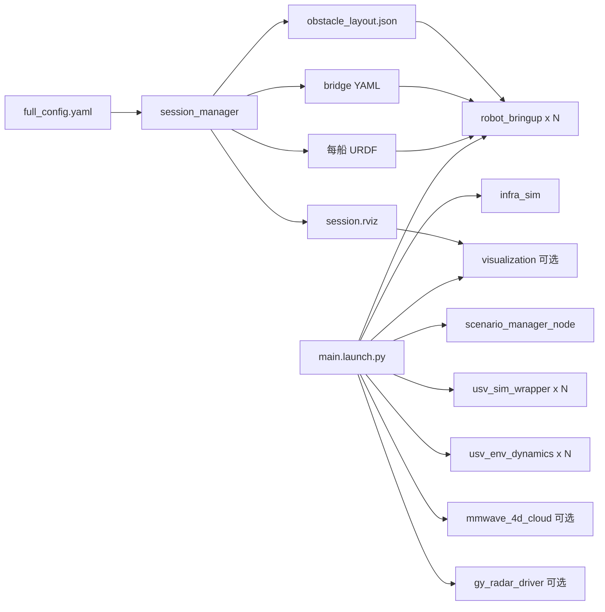

# usv_sim_full — YAML 驱动的 USV 全功能仿真启动包

`usv_sim_full` 是 USV 仿真栈的**协调与启动包**：用一份 YAML 描述世界、多船、传感器与障碍/场景，经 `session_manager` 生成 URDF、ROS–Gazebo 桥接与 RViz 配置，再按模块拉起 Gazebo（Gz Sim + `ros_gz_sim`）、机器人、桥接与可选导航/雷达后处理。

## 系统特性（当前实现）

- **模块化启动**：`infra_sim`（世界 + 全局桥接）、`robot_bringup`（单船：状态发布、延时 spawn、传感器桥接、可选海事雷达桥、障碍物）、`visualization`（RViz）。
- **多船配置**：顶层 `robot_1`、`robot_2`、… 块；每船独立 URDF/桥接/spawn 延迟；障碍物生成仅第一艘船执行，避免重复。
- **传感器类型**（在 `full_config.yaml` 的 `sensors` 列表中配置）：`lidar`、`camera`、`imu`、`gps`、`maritime_radar`（扇区经 `radar_gz_bridge`）、`mmwave_radar`（Gz `gpu_ray` → 桥接 → `usv_mmwave_sim::mmwave_4d_cloud_node` 输出带点云字段的最终话题）。
- **海事雷达建图**：启用 `maritime_radar` 时，`main.launch.py` 按船拉起 `gy_radar_driver` 的建图/转换链路（OccupancyGrid、NavRadar 点云等，依赖工作区已构建该包）。
- **场景与动力学**：`scenario_manager_node` 读配置驱动动态障碍等；每船可按 YAML `enable_env_dynamics` 启动 `usv_env_dynamics`（风/流）；`usv_sim_wrapper` 汇总状态话题。
- **可选定位**：`main.launch.py` 支持 `enable_robot_localization` + `robot_localization`（EKF + navsat），与静态 `map`→`{robot}/odom` 互斥/互补由参数控制。
- **Nav2 集成**：`nav2_sim_full_bringup.launch.py` 在整仿真空后延时启动命名空间化 Nav2；`nav2_thruster_bringup.launch.py` 提供 `tf_namespace_relay`、`cmd_vel_to_thruster` 与雷达栅格地图话题注入。

## 依赖（与 launch 强相关）

构建本包前请确保工作区已包含并可编译：`wamv_gazebo`、`wamv_description`（经 `wamv_gazebo` 等间接使用）、`ros_gz_sim`、`ros_gz_bridge`、`usv_interfaces`、`usv_mmwave_sim`（毫米波插件 + 点云增强节点）、`radar_gz_bridge`（海事雷达 spokes→ROS）、`robot_localization`（可选）。  
**海事雷达建图**依赖 `gy_radar_driver`；**在已运行仿真中 spawn 毫米波探针**依赖 `usv_mmwave_sim`（直接 `ros2 launch usv_mmwave_sim spawn_ego_mmwave_validation.launch.py`，参数见该文件）。

## 安装与构建

在工作区根目录（例如本仓库 `USV_ROS`）执行：

```bash
cd /path/to/USV_ROS
colcon build --packages-select usv_sim_full --symlink-install
source install/setup.bash
```

修改 `usv_interfaces` 等接口包后，请按依赖顺序重编相关包。

## Launch 入口一览

| 文件 | 作用 |
|------|------|
| `launch/main.launch.py` | **唯一全量主入口**：`session_manager` → `infra_sim` + 每船 `robot_bringup`（海事雷达桥按块开关）；静态 `map`→`{robot}/odom`；可选 RViz（追加雷达栅格与首船前相机）；每船 `usv_sim_wrapper`；按配置 `enable_env_dynamics` 启 `usv_env_dynamics`；`scenario_manager_node`；毫米波 `mmwave_4d_cloud_node`；海事雷达时 `gy_radar_driver`。参数：`config_path`、`enable_robot_localization`、`localization_params_file`、`localization_start_delay`、`use_static_map_odom_tf`。毫米波最小场景可 `config_path:=$(ros2 pkg prefix usv_sim_full)/share/usv_sim_full/config/mmwave_sydney_minimal.yaml`。 |
| `launch/nav2_sim_full_bringup.launch.py` | 先启动 `main.launch.py`（整船仿真），**延时**后启动 `nav2_thruster_bringup.launch.py`；可选启动前 `pkill` 清理与 Fast DDS shm 清理。`namespace` 默认 `auto` 时从 YAML 解析首船名。 |
| `launch/nav2_thruster_bringup.launch.py` | 单船 **Nav2**：`tf_namespace_relay`、改写 `radar_nav2_param.yaml` 中 static_layer 的 `map_topic` 指向 `/{ns}/map/navradar/occupancy_grid`，再 `navigation_launch.py`；并行启动 `cmd_vel_to_thruster`。 |
| `launch/sensor_tune.launch.py` | **无 Gazebo**：仅 `session_manager` + `robot_state_publisher` + `joint_state_publisher_gui` + `config/tf_tune.rviz`，用于 URDF/TF 与关节在 RViz 中调试。支持 `robot_index` 选择多船中的序号。 |
| `launch/test_hull.launch.py` | **简化水面** `test_env/simple_water.sdf` + 每船 `robot_bringup` + session 生成的 RViz；用于船体/浮力快速验证。 |
| `launch/components/infra_sim.launch.py` | 设置 `GZ_SIM_RESOURCE_PATH` / `GAZEBO_MODEL_PATH` / `GZ_SIM_SYSTEM_PLUGIN_PATH`（含 `gz_maritime_radar_plugin`），按 `world_name` 选择 `worlds/<name>.sdf` 或 `.world`，`gz_sim.launch.py` + `global_bridge.yaml`。 |
| `launch/components/robot_bringup.launch.py` | 单船：延时 `ros_gz_sim create`、`parameter_bridge`、`odom_tf_broadcaster`、可选 `radar_gz_bridge`、可选 `robot_localization`、命名空间内 `robot_state_publisher`、条件 `obstacle_spawner`。 |
| `launch/components/visualization.launch.py` | `rviz2 -d <session 生成的 rviz>`。 |

## 配置要点

- **世界**：`environment.world_name`（如 `sydney_regatta`），对应 `worlds/<world_name>.sdf` 或 `.world`。
- **可视化**：`visualization.launch_rviz` 控制主流程是否包含 RViz（`mmwave_sydney_minimal.yaml` 中可关 RViz 做轻量测试）。
- **船与传感器**：`robot_1`、`robot_2`、… 内 `name`、`xacro_template`、`spawn_pose`、`sensors` 等；传感器 `override_topic` 建议为**不含船名前缀**的绝对路径风格，由生成逻辑与 `$(arg namespace)` 拼成最终话题（见 `config/full_config.yaml` 顶部注释）。
- **障碍与场景**：`obstacles` 与 `scenario` 由 `session_manager` / `scenario_manager_node` / `obstacle_spawner` 等协同（细节以 `scripts/session_manager.py` 与配置为准）。
- **毫米波默认参数**：可通过 `sensor_config_path`（如 `config/sensor_config.yaml`）与 `mmwave.default` 等节覆盖。

## 快速开始

```bash
source /path/to/USV_ROS/install/setup.bash

# 完整仿真（默认 share 内 full_config.yaml）
ros2 launch usv_sim_full main.launch.py

# 指定配置
ros2 launch usv_sim_full main.launch.py config_path:=/path/to/my.yaml

# 毫米波最小场景（config/mmwave_sydney_minimal.yaml）
ros2 launch usv_sim_full main.launch.py config_path:=$(ros2 pkg prefix usv_sim_full)/share/usv_sim_full/config/mmwave_sydney_minimal.yaml

# 简化水面船体测试
ros2 launch usv_sim_full test_hull.launch.py

# 仅 URDF/关节/TF 调参（不启 Gazebo）
ros2 launch usv_sim_full sensor_tune.launch.py

# 仿真 + 延时 Nav2（需完整依赖与雷达地图等话题就绪）
ros2 launch usv_sim_full nav2_sim_full_bringup.launch.py
```

### 示例话题（船名为 `usv_1` 时）

命名空间以配置中 `robot_N.name` 为准，常见形式：

```bash
ros2 topic echo /usv_1/sensors/lidar/front_lidar/points --qos-reliability best_effort
ros2 topic echo /usv_1/sensors/camera/front_cam/image_raw
ros2 topic echo /usv_1/odom
ros2 topic echo /usv_1/sensors/mmwave/mmwave_front/points --qos-reliability best_effort
```

海事雷达后处理开启时，还可关注 `/{ship}/map/navradar/occupancy_grid`、`/{ship}/sensors/radar/nav/points` 等（与 `gy_radar_driver` 启动参数一致）。

## 架构示意



## 目录结构（摘要）

```
usv_sim_full/
├── config/           # full_config、mmwave 最小配置、global_bridge、robot_localization、Nav2 参数、tf_tune.rviz 等
├── launch/           # 上述各入口 + components/
├── usv_sim_full/
│   ├── scripts/      # session_manager、obstacle_spawner、wrapper、动力学、teleop、Nav2 桥接等
│   └── launch_config_helpers.py
├── description/      # xacro、模型资源
├── worlds/           # Gazebo 世界与资源
├── test_env/         # simple_water.sdf 等
└── logs/             # 运行时会话输出（若启用）
```

## 可执行入口（console_scripts）

含 `session_manager`、`obstacle_spawner`、`odom_tf_broadcaster`、`usv_sim_wrapper`、`usv_env_dynamics`、`scenario_manager_node`、`cmd_vel_to_thruster`、`tf_namespace_relay`、双桨遥控与诊断脚本等，详见 `setup.py` 的 `entry_points`。

## 故障排除（简要）

- **世界找不到**：检查 `environment.world_name` 与 `worlds/` 下文件名是否一致；`infra_sim` 启动时会列出可用 world 名。
- **海事雷达无数据**：确认 `GZ_SIM_SYSTEM_PLUGIN_PATH` 能加载 `gz_maritime_radar_plugin`；`radar_gz_bridge` 是否启用、`gz` 侧 spokes 话题与 `radar_sensor_name` 一致。
- **毫米波无点云**：确认 `usv_mmwave_sim` 已编、桥接话题与 `override_topic` 一致；可在已运行仿真中 `ros2 launch usv_mmwave_sim spawn_ego_mmwave_validation.launch.py` 对比独立探针话题。
- **RViz Fixed Frame 为 map 但无 TF**：`main.launch.py` 中 `use_static_map_odom_tf` 会为每船发布静态 `map`→`{sanitized}/odom`；多实例 launch 时注意勿重复发布同一 TF。
- **Nav2 无地图**：需海事雷达建图链路产生 `/{namespace}/map/navradar/occupancy_grid`，且 `nav2_thruster_bringup` 中 `namespace` 与船名一致。

## 许可证

本包在 `package.xml` 中声明为 **Apache-2.0**。仓库根目录若提供 `LICENSE`，以仓库为准。

## 更多信息

USV 仿真与其它包的协作说明见工作区根目录 `README.md` 及 `src/usv_simulation/docs/` 下文档。
