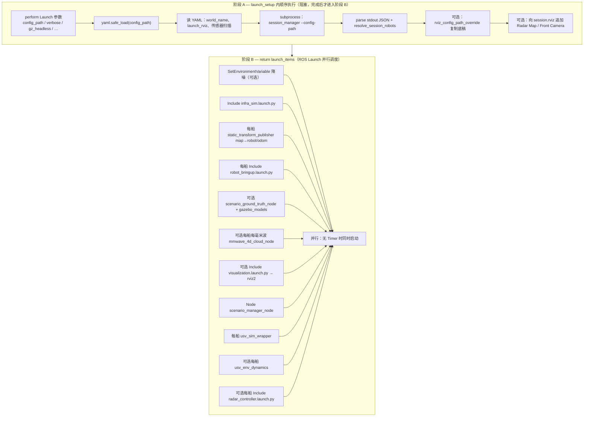
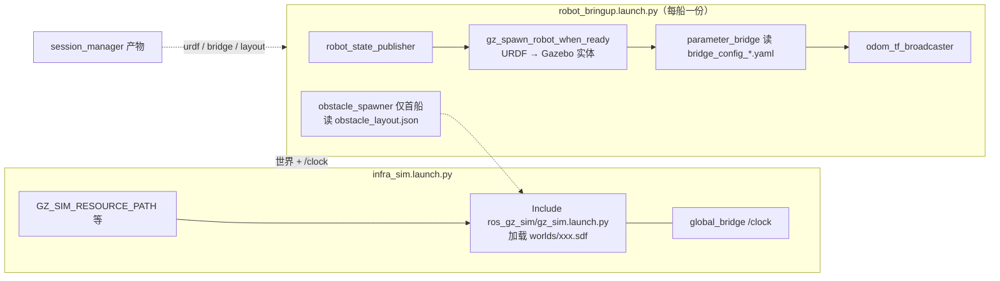
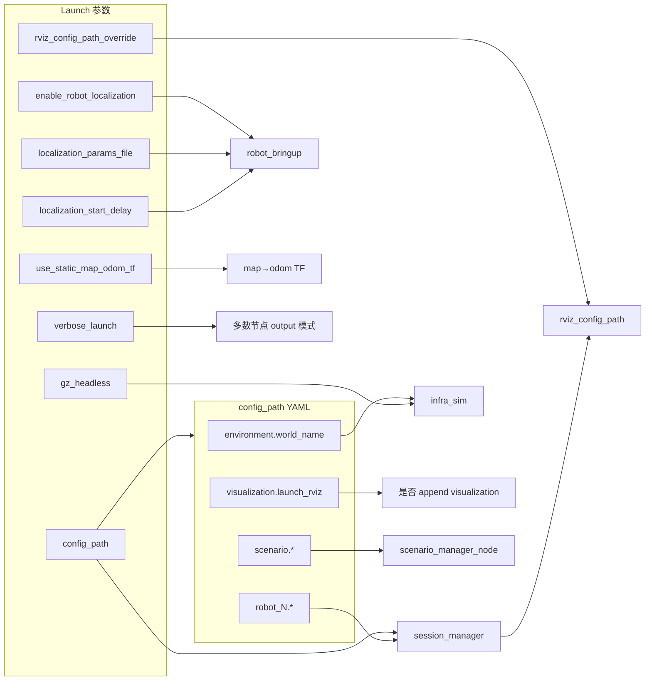
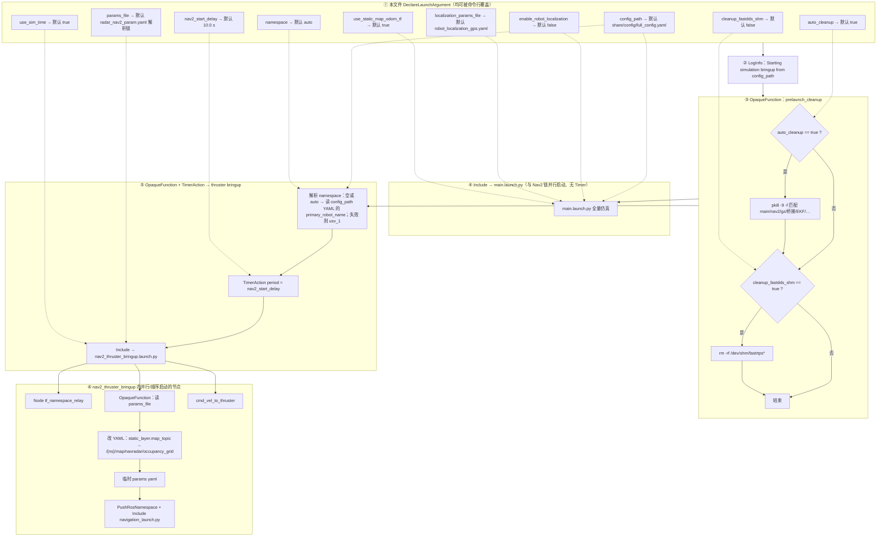

# `usv_sim_full/launch` 说明笔记

**用户向速览**（环境 → 怎么跑 → 怎么配 → 话题）：[`docs/docs_v3/QUICK_START.md`](../../docs/docs_v3/QUICK_START.md)。

本目录为 **`usv_sim_full` 包内仿真与导航相关的启动入口**；部分文件会 `Include` `components/` 下的组装件，或再 `Include` 其他包（如 `ros_gz_sim`、`gy_radar_driver`、`nav2_bringup`、`usv_mmwave_sim`）。

---

## 根目录：`*.launch.py`

| 文件 | 用途摘要 |
|------|-----------|
| **`main.launch.py`** | **唯一全量仿真主入口**：见下文 **「启动流程」**；`session_manager` 生成 URDF/桥接 → **`infra_sim`**（世界 SDF）与 **`robot_bringup`**（本船 spawn/桥接，并行）→ 可选 RViz / 毫米波 / 海事后处理 / **`scenario_manager_node`**（动态障碍）等。Launch 参数：`config_path`、`enable_robot_localization`、`localization_params_file`、`localization_start_delay`、`use_static_map_odom_tf`、`rviz_config_path_override`、`verbose_launch`、`gz_headless`。 |
| **`certifi_launch.launch.py`** | **认证会遇入口**：同步 **`merge_certi_config.py`** 合并 `certi_senario.yaml` + `certificate_case` → **`Include main.launch.py`**（`config_path:=merged`）+ 延时启动 **`cmd_vel_to_thruster`** / **`certi_own_ship_cmd_vel`**。不启动 Nav2。详见 [`docs_v3/QUICK_START.md`](../../docs/docs_v3/QUICK_START.md) §1.2。 |
| **`nav2_sim_full_bringup.launch.py`** | **仿真 + Nav2 一键 bringup**：可选启动前 `pkill` 清理残留进程；`Include` **`main.launch.py`** 拉起仿真；延时后再 `Include` **`nav2_thruster_bringup.launch.py`**。`namespace` 默认 `auto` 时从 `full_config` 解析主船名。 |
| **`nav2_thruster_bringup.launch.py`** | **仅导航与控制桥**（假定仿真已在跑）：`tf_namespace_relay`、动态改写 Nav2 代价地图 `map_topic` 指向 `/<ns>/map/navradar/occupancy_grid` 后 `Include` **`nav2_bringup/navigation_launch.py`**，并启动 **`cmd_vel_to_thruster`**。通常由 `nav2_sim_full_bringup` 调用，也可单独对接已运行的仿真。 |
| **`sensor_tune.launch.py`** | **无 Gazebo 的 TF/URDF 调参**：`session_manager` + 按 `robot_index` 选船 URDF，将 `model://` 转回 `package://` 后启动 `robot_state_publisher`、`joint_state_publisher_gui`、`rviz2`（`tf_tune.rviz`）。用于关节/连杆可视化调试，**不含仿真与桥接**。 |
| **`test_hull.launch.py`** | **简化船体/多船 bringup 测试**：固定 **`simple_water`** 世界（`gz sim -r`），按 `session_manager` 多船循环 **`Include` → `components/robot_bringup.launch.py`**（首船启障碍 spawner 等）；会话 RViz 配置驱动 **`rviz2`**。用于验证船体参数与多船 spawn，**非正式比赛/完整世界流程**。 |

**毫米波相关（原独立 launch 已移除）**

- **悉尼毫米波最小场景**：与原先 `mmwave_sydney_minimal.launch.py` 等价，请直接 **`main.launch.py`** 并指定配置，例如（需已 `source install/setup.bash`）：  
  `ros2 launch usv_sim_full main.launch.py config_path:=$(ros2 pkg prefix usv_sim_full)/share/usv_sim_full/config/mmwave_sydney_minimal.yaml`
- **在已运行仿真中 spawn 毫米波验证体**：请直接调用 **`usv_mmwave_sim`** 包内 **`spawn_ego_mmwave_validation.launch.py`**（参数见该文件内 `DeclareLaunchArgument`），不再经本目录封装。

---

## 子目录：`components/*.launch.py`

| 文件 | 用途摘要 |
|------|-----------|
| **`infra_sim.launch.py`** | **基础设施层**：设置 `GZ_SIM_RESOURCE_PATH` / `GAZEBO_MODEL_PATH` / `GZ_SIM_SYSTEM_PLUGIN_PATH`，按 `world_name` 选择 `usv_sim_full/worlds` 下 `.sdf`/`.world`，**`Include` → `ros_gz_sim/gz_sim.launch.py`**；并启动全局 **`ros_gz_bridge`**（`global_bridge.yaml`）。 |
| **`robot_bringup.launch.py`** | **单船容器**：命名空间下 spawn 实体、`ros_gz_bridge`、传感器桥、可选 maritime 雷达桥、`odom_tf_broadcaster`、定位相关节点等。被 **`main.launch.py`**、**`test_hull.launch.py`** 等引用。 |
| **`visualization.launch.py`** | **仅 RViz2**：参数 `rviz_config_path` 传入配置文件路径。被 **`main.launch.py`** 等引用。 |

---

## `main.launch.py`：启动流程

### 「description」从哪来？和 `config_path` YAML 的关系

流程图 **① `DeclareLaunchArgument`** 里的 `P_cfg`、`P_rl` 等，对应 **`generate_launch_description()` 里 `DeclareLaunchArgument(..., description='…')` 的第三个参数**——这是 **Launch 参数的帮助文案**（`ros2 launch … --show-args` 可见），**不是**从 `config_path` 指向的 YAML 里读出来的。

| 来源 | 例子 | 谁消费 |
|------|------|--------|
| **Launch 参数**（命令行 `xxx:=` 可覆盖） | `config_path`、`enable_robot_localization`、`use_static_map_odom_tf`、`rviz_config_path_override`、`verbose_launch`、`gz_headless` | `launch_setup` 里 `LaunchConfiguration('…').perform(context)` |
| **`config_path` YAML 字段** | `environment.world_name`、`visualization.launch_rviz`、`robot_N.*`、`scenario.*` | `launch_setup` 里 `yaml.safe_load(config_path)` 后按键读取 |

二者关联方式：**Launch 参数决定「读哪个 YAML、是否覆盖 RViz 底稿」**；YAML 决定 **世界名、是否开 RViz、船与传感器、场景** 等业务内容。例如 `config_path:=…/certi_senario.yaml` 不会改 Launch 参数的 `description` 字符串，但会改变读到的 `launch_rviz`、`world_name` 等。

---

### 实际分两阶段：先阻塞准备，再并行拉起

ROS 2 Launch 对 **`OpaqueFunction` 返回的列表**里各项，默认 **并行调度**。`main.launch.py` 的唯一 **严格先后顺序** 是：

1. **`launch_setup` 整段跑完**（含 **`session_manager` 子进程阻塞**）→ 才 `return launch_items`；
2. 返回列表中的 **`infra_sim` / 各船 `robot_bringup` / RViz / 节点** 等，由 launch 系统 **同时开始启动**（彼此无 `TimerAction` 串联）。

因此：**不是**「先拼完世界 SDF，再串行调 bringup」；而是 **session 产物先生成**，然后 **Gazebo 世界（infra）与本船 spawn/桥接（bringup）并行起跑**，靠 **`gz_spawn_robot_when_ready` 轮询 `/clock` 与 create 服务** 避免过早 insert。



**数据依赖（并行启动下仍须满足）**

| 消费者 | 依赖 | 如何等待 |
|--------|------|----------|
| **`infra_sim` → `gz sim`** | 世界 SDF 路径 | 立即起进程 |
| **`robot_bringup` → `gz_spawn_robot_when_ready`** | `/clock`、Gazebo **`/world/{name}/create`** | 节点内墙钟轮询 + `spawn_stagger_sec` |
| **`parameter_bridge`** | 实体已 spawn、Gz 话题存在 | 桥接重连/首包可能略晚 |
| **`scenario_manager_node`** | 世界名、`dynamic_obstacles` | 内部 `ros_gz_sim create`；与 ego spawn **并行**，动态障碍可能略晚于本船 |
| **RViz** | TF、`/clock` | 无硬同步；点云/相机需 map→odom 已发布 |

---

### `session_manager` 做什么？（不拼世界 SDF）

`session_manager` **不生成、不修改** `worlds/*.sdf`。世界文件由 **`infra_sim.launch.py`** 按 `environment.world_name` 直接交给 **`ros_gz_sim/gz_sim.launch.py`**。

`session_manager` 在会话目录（如 `/tmp/usv_sim_sessions/...`）为 **每艘本船（ego）** 生成：

| 产物 | 说明 |
|------|------|
| `generated_sensors_*.xacro` | 由 `full_config` 的 `sensors[]` 生成传感器挂载片段 |
| `final_robot_*.urdf` | **xacro 编译**（含 Gazebo 插件：推进器、gpu_ray、海事雷达等）→ URDF；后处理 `package://`→`model://` |
| `bridge_config_*.yaml` | **ros_gz_bridge** 话题映射（传感器 gz↔ROS） |
| `session.rviz` | 首船传感器 Display 等（供 RViz 默认布局） |
| `obstacle_layout.json` | **`obstacles.fixed_list` / `random_areas`** 静态障碍布局（**不是** `scenario.dynamic_obstacles`） |

stdout 末尾 JSON 含 `rviz_config_path`、`obstacle_layout_path`、`robots[]`（`urdf_path`、`bridge_yaml_path`、`spawn_pose`），供 `main.launch.py` 传给 bringup。

**本船进 Gazebo**：`robot_bringup` 把 **URDF 当 SDF 文件** 交给 `gz_spawn_robot_when_ready` → `ros_gz_sim create` insert。**动态目标船**（认证合并后的 `dynamic_obstacles`）由 **`scenario_manager_node`** 另写临时 SDF 并 create，与本船 URDF 链路独立。

---

### `infra_sim` / `robot_bringup` / Gazebo 分工



---

### `launch_rviz` 在哪里实现？

开关与路径 **两层**：

| 层级 | 位置 | 行为 |
|------|------|------|
| **是否启动 RViz** | **`main.launch.py` `launch_setup`** | 读 YAML **`visualization.launch_rviz`**（默认 `true`）；仅当为真时 `launch_items.append(viz_launch)` |
| **RViz 配置文件** | **`session_manager`** → 可选 **`main` 补丁** | 默认生成 **`session.rviz`**；`main` 可向其中追加 Radar OccupancyGrid、Front Camera（除非跳过） |
| **覆盖底稿** | Launch 参数 **`rviz_config_path_override`** | 非空则复制该文件到临时路径作为 `rviz_config_path`，并 **跳过** session 追加 Display（避免破坏 YAML 结构）；`nav2_sim_full_bringup` 常传 `default.rviz` |
| **真正起进程** | **`components/visualization.launch.py`** | `OpaqueFunction` → **`Node(rviz2, args=['-d', rviz_config_path])`** |

代码锚点：

```159:159:src/usv_simulation/usv_sim_full/launch/main.launch.py
    launch_rviz = user_config.get('visualization', {}).get('launch_rviz', True)
```

```409:410:src/usv_simulation/usv_sim_full/launch/main.launch.py
    if launch_rviz:
        launch_items.append(viz_launch)
```

认证基底 `certi_senario.yaml` 中 `visualization.launch_rviz: true` 即走上述路径；关 RViz 则设 **`launch_rviz: false`**，不会 Include `visualization.launch.py`。

---

### `launch_items` 追加顺序（代码顺序 ≠ 运行串行）

以下为 **`launch_setup` 内 `launch_items.append` 的真实顺序**（便于对照源码）；**除阶段 A 外，阶段 B 各项并行**。

| 序号 | 动作 | 条件 |
|------|------|------|
| 1 | `SetEnvironmentVariable RCUTILS_LOGGING_SEVERITY=WARN` | 非 verbose |
| 2 | **Include `infra_sim.launch.py`** | 总是 |
| 3 | 每船 **`static_transform_publisher`** `map`→`{sanitized}/odom` | `use_static_map_odom_tf` |
| 4 | 每船 **Include `robot_bringup.launch.py`** | 总是 |
| 5 | **`scenario_ground_truth_node`** | `scenario.ground_truth_sim.enabled` |
| 6 | **`scenario_ground_truth_gazebo_models`** | 且 `gazebo_visual: true` |
| 7 | 每船每毫米波 **`mmwave_4d_cloud_node`** | 配置含 enabled mmwave |
| 8 | **Include `visualization.launch.py`** | **`visualization.launch_rviz`** |
| 9 | **`scenario_manager_node`** | 总是（读 `scenario.dynamic_obstacles`） |
| 10 | 每船 **`usv_sim_wrapper`** | 总是 |
| 11 | 每船 **`usv_env_dynamics`** | `enable_env_dynamics` |
| 12 | 每船 **Include `radar_controller.launch.py`** | 存在 enabled 海事雷达 |

### Launch 参数 → 组件映射（与 `config_path` YAML 对照）



### `robot_bringup` 每船传入要点（摘要）

仿真使用 **`/clock`（`use_sim_time`）** 时，`main.launch.py` 里 **`map`→`{robot}/odom` 的 `static_transform_publisher` 也必须 `use_sim_time: true`**。否则静态 TF 用墙钟打戳，Nav2 用仿真时刻查 TF，会出现 **`Invalid frame ID "map"`** 或 **`Timed out waiting for transform ... to map`**（`tf2_echo` 也可能先报错再变好）。**`nav2_sim_full_bringup`** 默认 **`nav2_start_delay:=15`**，在 spawn/桥接稍慢时可再加大。

### `robot_bringup` 每船传入要点（摘要）

| 参数来源 | 说明 |
|----------|------|
| `session_manager` / `resolve_session_robots` | `robot_name`、`urdf_path`、`bridge_yaml_path`、`spawn_pose` |
| YAML `ship_config_blocks` | `enable_maritime_radar_bridge`、`radar_sensor_name`、`radar_ros_topic` |
| 索引 `idx` | `enable_obstacle_spawner` 仅首船 `true`；`create_entity_delay` 错开 spawn |
| 固定/全局 | `obstacle_layout_path`、`gz_world_name`（= `world_name`）、`use_sim_time:=true` |
| Launch 参数 | `enable_robot_localization`、`localization_params_file`、`localization_start_delay` |

### 职责边界：`scenario_manager_node` 与 `robot_bringup` 是否「抢同一套 robot 参数」？

**并不矛盾，配置对象不同：**

| 组件 | 读的 YAML / 段落 | 实际做什么 |
|------|------------------|------------|
| **`robot_bringup.launch.py`** | 间接依赖 `session_manager` 已生成的 **URDF、桥接 YAML、障碍布局**；Launch 再传入每船的 `robot_name`、位姿、海事雷达桥开关等 | **本船（ego）**：在 Gz 里 spawn 模型、起 `parameter_bridge`（含 session 里写的各传感器话题）、可选 **`radar_gz_bridge`**（海事扫描 → ROS 扇区）、`odom`/TF/定位等 **仿真与桥接层** |
| **`scenario_manager_node`** | 仅 **`scenario.dynamic_obstacles`**（以及 `environment.world_name` 用于 spawn 服务名） | **场景里的动态障碍**（如巡逻艇）：生成简单 SDF、spawn、`cmd_vel` 环路、为障碍再起小型桥；**不读 `robot_1.sensors`，不改本船 URDF/海事或毫米波参数** |

因此流程图里二者相邻，只是 **launch 列表顺序** 如此，不是「两个节点都在配置同一艘船的 maritime/mmwave」。

### `NodeShared::RecvSrvRequest() error sending response: Host unreachable`

出自 **Gazebo Sim 的 gz-transport**（TCP 回包到服务调用方失败），常见于：

- **多机/容器与宿主机混跑**：`gz service` 子进程或另一终端里的客户端连到了**错误的 discovery 端点**（例如仍指向旧容器 IP）。同一台机器上跑仿真时，尽量 **统一终端**、同一 `ROS_DOMAIN_ID`，并避免残留 **`GZ_IP` / `IGN_IP`** 指向不可达地址。
- **防火墙或网络分区**：阻断 gz-transport 选用的回连端口。
- **多实例冲突**：两台 `gz sim` 或错误 `GZ_PARTITION` 导致服务注册混乱。

排查：只保留一个仿真实例；`unset GZ_IP IGN_IP` 后重开 shell；在**与 launch 同一环境**下执行 `gz service -l` 确认世界服务存在。

开启 **`gazebo_visual`** 时，若仍频繁出现该报错，多为 **多个 `ros_gz_sim create` 与 `gz service set_pose_vector` 同时打 gz-transport**。`ground_truth_gazebo_models_node` 已对 **create / remove / set_pose** 子进程 **全局互斥**，并 **保留 create 用临时 SDF 至节点退出**（避免 Gazebo 异步读文件时路径已删）。

### 海事雷达 vs 毫米波：同级传感器，为何拆在 `robot_bringup` 与 `main`？

在 **`full_config` 里二者同级**（都在某船的 `sensors` 列表），但 **仿真管线长度不同**，代码按层拆开：

- **海事雷达**  
  - **Gz 插件 → spokes**；**`robot_bringup`** 里可选启动 **`radar_gz_bridge`**，把 Gz 侧数据变成 ROS 扇区话题（与 session 生成的桥接配置同一层级，属于「本船必连仿真」）。  
  - **扇区 → 点云 / OccupancyGrid** 在 **`gy_radar_driver`** 的 **`radar_controller`**，依赖重、参数多，放在 **`main.launch.py` 里按船 Include**，避免让通用 `robot_bringup` 强依赖该包。

- **毫米波**  
  - Gz 侧 **`gpu_ray` + 桥接** 同样由 session 的桥接 YAML 在 **`robot_bringup` 的 `parameter_bridge`** 里带上。  
  - **`points_gz` → 带 RCS 等字段的最终点云** 由 **`usv_mmwave_sim::mmwave_4d_cloud_node`** 完成，属于 **独立包的后处理**；与海事侧「桥在 bringup、算法在 main」的拆分理由一致。

若未来希望 **结构上更对称**，可以把 `mmwave_4d_cloud_node` / `radar_controller` 的启动挪进 `robot_bringup`（用条件 Include），但会加深 `robot_bringup` 对 `usv_mmwave_sim`、`gy_radar_driver` 的耦合；当前做法是 **bringup = 实体 + 通用桥；main = 会话编排 + 可选重型后处理**。

### 与 Nav2 全量 bringup 图的关系

**`nav2_sim_full_bringup`** 仅向 `main.launch.py` 转发 `config_path`、`enable_robot_localization`、`localization_params_file`、`use_static_map_odom_tf`；**不转发** `localization_start_delay`（`main` 内用声明的默认值）。

---

## `nav2_sim_full_bringup.launch.py`：联动与参数（初版 mermaid）

以下为 **第一版** 示意图，便于后续按实际调参习惯再改。执行顺序自上而下；实线箭头表示 **Include / 启动动作**，虚线表示 **参数传递**（Launch 参数名与代码一致）。



### 参数传递对照（与上图呼应）

| 来源 | 目标 | 传递的 launch 参数 / 行为 |
|------|------|---------------------------|
| `nav2_sim_full_bringup` | `main.launch.py` | `config_path`、`enable_robot_localization`、`localization_params_file`、`use_static_map_odom_tf` |
| `nav2_sim_full_bringup` | `nav2_thruster_bringup.launch.py`（经 Timer） | `namespace`（解析后）、`params_file`、`use_sim_time` |
| `nav2_sim_full_bringup` | （不传给 main） | **`localization_start_delay`** 未转发；`main` 侧使用该参数默认值。 |
| `nav2_thruster_bringup` | `navigation_launch.py` | `namespace`、`params_file`（实为**改写 map_topic 后的临时文件**）、`use_sim_time` |

> **初版说明**：`params_file` 在 `nav2_sim_full_bringup` 与 `nav2_thruster_bringup` 中各自有一套「源码树 → usv_sim_full 安装 → gy_radar_driver」的默认路径解析，二者默认应对齐；若只改其一的命令行 `params_file:=`，以 bringup 传给 thruster 的为准。

---

## `ground_truth_sim` 与 Nav2 / P3D / Gazebo 实体（备忘）

- **`overrides.ground_truth_enabled`**（xacro）：URDF 内 **Gazebo P3D 真值里程计**，与 ROS 包 **`ground_truth_sim`** 无关。
- **`scenario.ground_truth_sim.enabled`**：启动 **`scenario_ground_truth_node`**，在 **map** 系发布 **`/sim/ground_truth`** 与 **`/sim/ground_truth_markers`**；环带圆心取 **`reference_robot`**。与 **Nav2** 通常 **可并存**（本船仍由 Nav2/推进驱动时）。RViz 中 Marker 命名空间为 **`target_pose` / `target_path` / `target_history`**；插件面板里那句 *“Displays visualization_msgs::MarkerArray…”* 为 **插件说明**，非报错。
- **`scenario.ground_truth_sim.gazebo_visual`**：启动 **`ground_truth_gazebo_models_node`**，订阅同一真值话题，在 **`environment.world_name`** 对应世界中 **`/world/<name>/create`** 生成 **圆柱 SDF**（`size_l/size_w` → 水平最小外接圆半径，`size_h` → 柱高），周期 **`set_pose`**。**占位几何**：当前为柱状浮体，便于在 Gazebo 窗口可见；**后续可换**为实船 URDF/SDF（扩展节点或替换 spawn 模板即可）。
- **Nav2 代价地图**：当前**未**将 CTRV 真值接入局部/全局 costmap；若需规划避障「看见」虚拟目标，后续再定（如 `PointCloud2` + `voxel_layer` 等）。
- 若将来某船改为 **本船位姿仅由仿真绝对真值写出**（如 `SetEntityPose` 驱动本船），则应 **关闭** 该船的 Nav2/推进闭环，避免双重控制。

---

## 典型启动命令（备忘）

```bash
source install/setup.bash
ros2 launch usv_sim_full main.launch.py
ros2 launch usv_sim_full nav2_sim_full_bringup.launch.py
# 毫米波最小场景示例：
# ros2 launch usv_sim_full main.launch.py config_path:=$(ros2 pkg prefix usv_sim_full)/share/usv_sim_full/config/mmwave_sydney_minimal.yaml
```

参数以各文件内 `DeclareLaunchArgument` 为准；`config_path` 多为核心开关。


