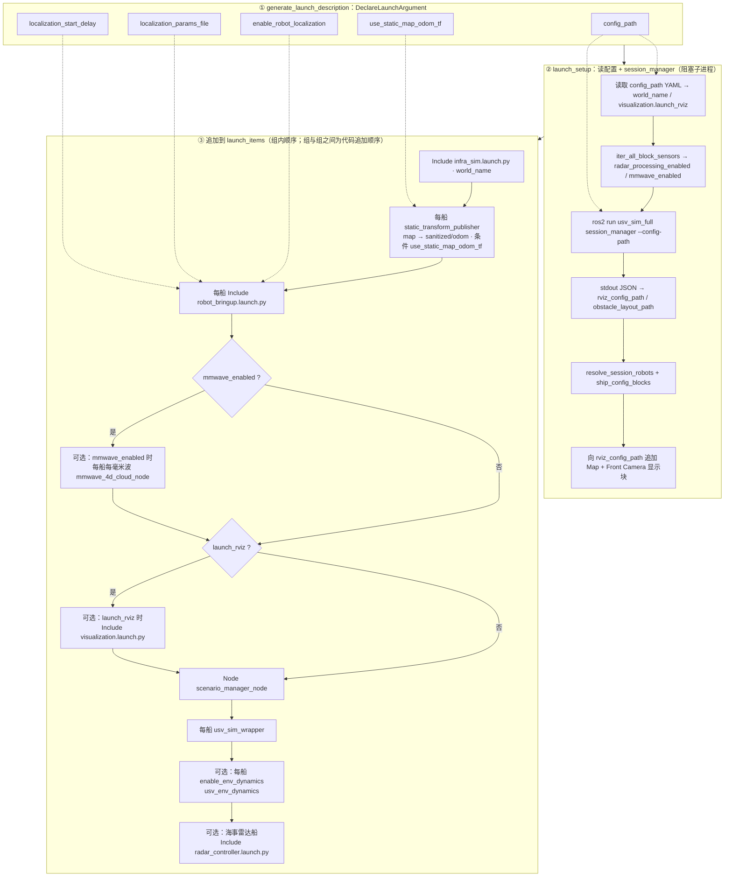
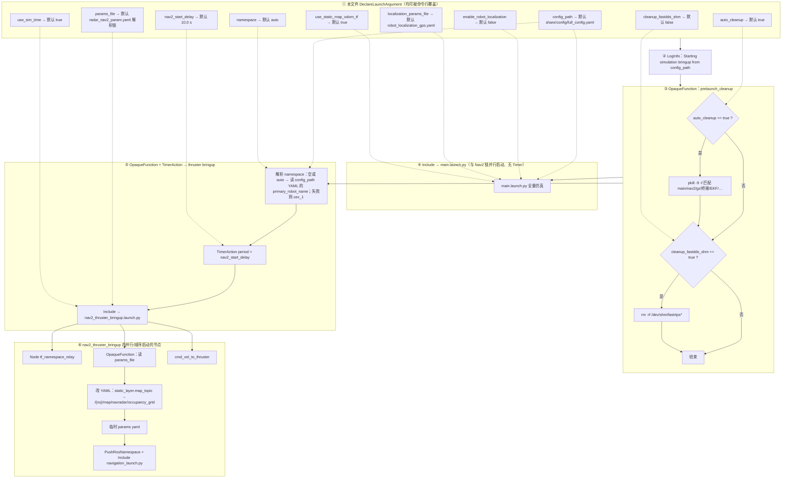

# `usv_sim_full/launch` 说明笔记

**用户向速览**（环境 → 怎么跑 → 怎么配 → 话题）：[`docs/docs_v3/QUICK_START.md`](../../docs/docs_v3/QUICK_START.md)。

本目录为 **`usv_sim_full` 包内仿真与导航相关的启动入口**；部分文件会 `Include` `components/` 下的组装件，或再 `Include` 其他包（如 `ros_gz_sim`、`gy_radar_driver`、`nav2_bringup`、`usv_mmwave_sim`）。

---

## 根目录：`*.launch.py`

| 文件 | 用途摘要 |
|------|-----------|
| **`main.launch.py`** | **唯一全量仿真主入口**：`session_manager` 解析多船 → **`infra_sim`** → 每船静态 **`map`→`{sanitized}/odom`**（可关）→ **逐船 `robot_bringup`**（海事雷达桥按传感器块开关）；若 **`scenario.ground_truth_sim.enabled`** 则启动全局 **`scenario_ground_truth_node`**（map 系 CTRV 周邻真值）；可选 **RViz**；配置含毫米波时启动 **`mmwave_4d_cloud_node`**；每船 **`usv_sim_wrapper`**；**`enable_env_dynamics`**；**`scenario_manager_node`**；海事雷达时按船 **`gy_radar_driver/radar_controller`**。Launch 参数：`config_path`、`enable_robot_localization`、`localization_params_file`、`localization_start_delay`、`use_static_map_odom_tf`。 |
| **`nav2_sim_full_bringup.launch.py`** | **仿真 + Nav2 一键 bringup**：可选启动前 `pkill` 清理残留进程；`Include` **`main.launch.py`** 拉起仿真；延时后再 `Include` **`nav2_thruster_bringup.launch.py`**。`namespace` 默认 `auto` 时从 `full_config` 解析主船名。 |
| **`nav2_thruster_bringup.launch.py`** | **仅导航与控制桥**（假定仿真已在跑）：`tf_namespace_relay`、动态改写 Nav2 代价地图 `map_topic` 指向 `/<ns>/map/navradar/occupancy_grid` 后 `Include` **`nav2_bringup/navigation_launch.py`**，并启动 **`cmd_vel_to_thruster`**。通常由 `nav2_sim_full_bringup` 调用，也可单独对接已运行的仿真。 |
| **`mmwave_sydney_minimal.launch.py`** | **薄封装**：默认 `config/mmwave_sydney_minimal.yaml`，其余参数与 `main.launch.py` 对齐，内部 **`Include` → `main.launch.py`**。用于悉尼场景下毫米波最小验证，减少命令行长度。 |
| **`spawn_mmwave_probe_in_running_sim.launch.py`** | **叠加式调试入口**：在 **已运行** 的完整仿真（如 `main.launch.py`）上，再 **`Include` → `usv_mmwave_sim/spawn_ego_mmwave_validation.launch.py`**，独立 spawn 验证体与话题（默认 `/mmwave_spawn_test/points`），不改动主 USV。 |
| **`sensor_tune.launch.py`** | **无 Gazebo 的 TF/URDF 调参**：`session_manager` + 按 `robot_index` 选船 URDF，将 `model://` 转回 `package://` 后启动 `robot_state_publisher`、`joint_state_publisher_gui`、`rviz2`（`tf_tune.rviz`）。用于关节/连杆可视化调试，**不含仿真与桥接**。 |
| **`test_hull.launch.py`** | **简化船体/多船 bringup 测试**：固定 **`simple_water`** 世界（`gz sim -r`），按 `session_manager` 多船循环 **`Include` → `components/robot_bringup.launch.py`**（首船启障碍 spawner 等）；会话 RViz 配置驱动 **`rviz2`**。用于验证船体参数与多船 spawn，**非正式比赛/完整世界流程**。 |

---

## 子目录：`components/*.launch.py`

| 文件 | 用途摘要 |
|------|-----------|
| **`infra_sim.launch.py`** | **基础设施层**：设置 `GZ_SIM_RESOURCE_PATH` / `GAZEBO_MODEL_PATH` / `GZ_SIM_SYSTEM_PLUGIN_PATH`，按 `world_name` 选择 `usv_sim_full/worlds` 下 `.sdf`/`.world`，**`Include` → `ros_gz_sim/gz_sim.launch.py`**；并启动全局 **`ros_gz_bridge`**（`global_bridge.yaml`）。 |
| **`robot_bringup.launch.py`** | **单船容器**：命名空间下 spawn 实体、`ros_gz_bridge`、传感器桥、可选 maritime 雷达桥、`odom_tf_broadcaster`、定位相关节点等。被 **`main.launch.py`**、**`test_hull.launch.py`** 等引用。 |
| **`visualization.launch.py`** | **仅 RViz2**：参数 `rviz_config_path` 传入配置文件路径。被 **`main.launch.py`** 等引用。 |

---

## `main.launch.py`：启动流程（mermaid）

以下为 **`OpaqueFunction(launch_setup)` 内实际执行顺序**（`launch_items` 的追加顺序）。ROS 2 launch 中同列表内多项会并行调度，图中自上而下表示 **代码组装顺序** 与 **数据依赖**；虚线表示 **Launch 参数** 或 **YAML 驱动**。



### `robot_bringup` 每船传入要点（摘要）

| 参数来源 | 说明 |
|----------|------|
| `session_manager` / `resolve_session_robots` | `robot_name`、`urdf_path`、`bridge_yaml_path`、`spawn_pose` |
| YAML `ship_config_blocks` | `enable_maritime_radar_bridge`、`radar_sensor_name`、`radar_ros_topic` |
| 索引 `idx` | `enable_obstacle_spawner` 仅首船 `true`；`create_entity_delay` 错开 spawn |
| 固定/全局 | `obstacle_layout_path`、`gz_world_name`（= `world_name`）、`use_sim_time:=true` |
| Launch 参数 | `enable_robot_localization`、`localization_params_file`、`localization_start_delay` |

### 职责边界：`scenario_manager_node` 与 `robot_bringup` 是否「抢同一套 robot 参数」？

**并不矛盾，配置对象不同：**

| 组件 | 读的 YAML / 段落 | 实际做什么 |
|------|------------------|------------|
| **`robot_bringup.launch.py`** | 间接依赖 `session_manager` 已生成的 **URDF、桥接 YAML、障碍布局**；Launch 再传入每船的 `robot_name`、位姿、海事雷达桥开关等 | **本船（ego）**：在 Gz 里 spawn 模型、起 `parameter_bridge`（含 session 里写的各传感器话题）、可选 **`radar_gz_bridge`**（海事扫描 → ROS 扇区）、`odom`/TF/定位等 **仿真与桥接层** |
| **`scenario_manager_node`** | 仅 **`scenario.dynamic_obstacles`**（以及 `environment.world_name` 用于 spawn 服务名） | **场景里的动态障碍**（如巡逻艇）：生成简单 SDF、spawn、`cmd_vel` 环路、为障碍再起小型桥；**不读 `robot_1.sensors`，不改本船 URDF/海事或毫米波参数** |

因此流程图里二者相邻，只是 **launch 列表顺序** 如此，不是「两个节点都在配置同一艘船的 maritime/mmwave」。

### 海事雷达 vs 毫米波：同级传感器，为何拆在 `robot_bringup` 与 `main`？

在 **`full_config` 里二者同级**（都在某船的 `sensors` 列表），但 **仿真管线长度不同**，代码按层拆开：

- **海事雷达**  
  - **Gz 插件 → spokes**；**`robot_bringup`** 里可选启动 **`radar_gz_bridge`**，把 Gz 侧数据变成 ROS 扇区话题（与 session 生成的桥接配置同一层级，属于「本船必连仿真」）。  
  - **扇区 → 点云 / OccupancyGrid** 在 **`gy_radar_driver`** 的 **`radar_controller`**，依赖重、参数多，放在 **`main.launch.py` 里按船 Include**，避免让通用 `robot_bringup` 强依赖该包。

- **毫米波**  
  - Gz 侧 **`gpu_ray` + 桥接** 同样由 session 的桥接 YAML 在 **`robot_bringup` 的 `parameter_bridge`** 里带上。  
  - **`points_gz` → 带 RCS 等字段的最终点云** 由 **`usv_mmwave_sim::mmwave_4d_cloud_node`** 完成，属于 **独立包的后处理**；与海事侧「桥在 bringup、算法在 main」的拆分理由一致。

若未来希望 **结构上更对称**，可以把 `mmwave_4d_cloud_node` / `radar_controller` 的启动挪进 `robot_bringup`（用条件 Include），但会加深 `robot_bringup` 对 `usv_mmwave_sim`、`gy_radar_driver` 的耦合；当前做法是 **bringup = 实体 + 通用桥；main = 会话编排 + 可选重型后处理**。

### 与 Nav2 全量 bringup 图的关系

**`nav2_sim_full_bringup`** 仅向 `main.launch.py` 转发 `config_path`、`enable_robot_localization`、`localization_params_file`、`use_static_map_odom_tf`；**不转发** `localization_start_delay`（`main` 内用声明的默认值）。

---

## `nav2_sim_full_bringup.launch.py`：联动与参数（初版 mermaid）

以下为 **第一版** 示意图，便于后续按实际调参习惯再改。执行顺序自上而下；实线箭头表示 **Include / 启动动作**，虚线表示 **参数传递**（Launch 参数名与代码一致）。



### 参数传递对照（与上图呼应）

| 来源 | 目标 | 传递的 launch 参数 / 行为 |
|------|------|---------------------------|
| `nav2_sim_full_bringup` | `main.launch.py` | `config_path`、`enable_robot_localization`、`localization_params_file`、`use_static_map_odom_tf` |
| `nav2_sim_full_bringup` | `nav2_thruster_bringup.launch.py`（经 Timer） | `namespace`（解析后）、`params_file`、`use_sim_time` |
| `nav2_sim_full_bringup` | （不传给 main） | **`localization_start_delay`** 未转发；`main` 侧使用该参数默认值。 |
| `nav2_thruster_bringup` | `navigation_launch.py` | `namespace`、`params_file`（实为**改写 map_topic 后的临时文件**）、`use_sim_time` |

> **初版说明**：`params_file` 在 `nav2_sim_full_bringup` 与 `nav2_thruster_bringup` 中各自有一套「源码树 → usv_sim_full 安装 → gy_radar_driver」的默认路径解析，二者默认应对齐；若只改其一的命令行 `params_file:=`，以 bringup 传给 thruster 的为准。

---

## `ground_truth_sim` 与 Nav2 / P3D（备忘）

- **`overrides.ground_truth_enabled`**（xacro）：URDF 内 **Gazebo P3D 真值里程计**，与 ROS 包 **`ground_truth_sim`** 无关。
- **`scenario.ground_truth_sim.enabled`**：由 **`main.launch.py`** 启动全局 **`scenario_ground_truth_node`**，在 **map** 系发布 **`/sim/ground_truth`**（及 markers）；环带圆心取 **`reference_robot`** 在 map 下的位置。**不**驱动 Gazebo 刚体；与 **Nav2** 通常 **可并存**。
- 若将来某船改为 **本船位姿/速度仅由仿真绝对真值写出**（如强制 `SetEntityPose` 驱动本船），则应 **关闭** 该船的 Nav2/推进闭环，避免双重控制。

---

## 典型启动命令（备忘）

```bash
source install/setup.bash
ros2 launch usv_sim_full main.launch.py
ros2 launch usv_sim_full nav2_sim_full_bringup.launch.py
ros2 launch usv_sim_full mmwave_sydney_minimal.launch.py
```

参数以各文件内 `DeclareLaunchArgument` 为准；`config_path` 多为核心开关。
